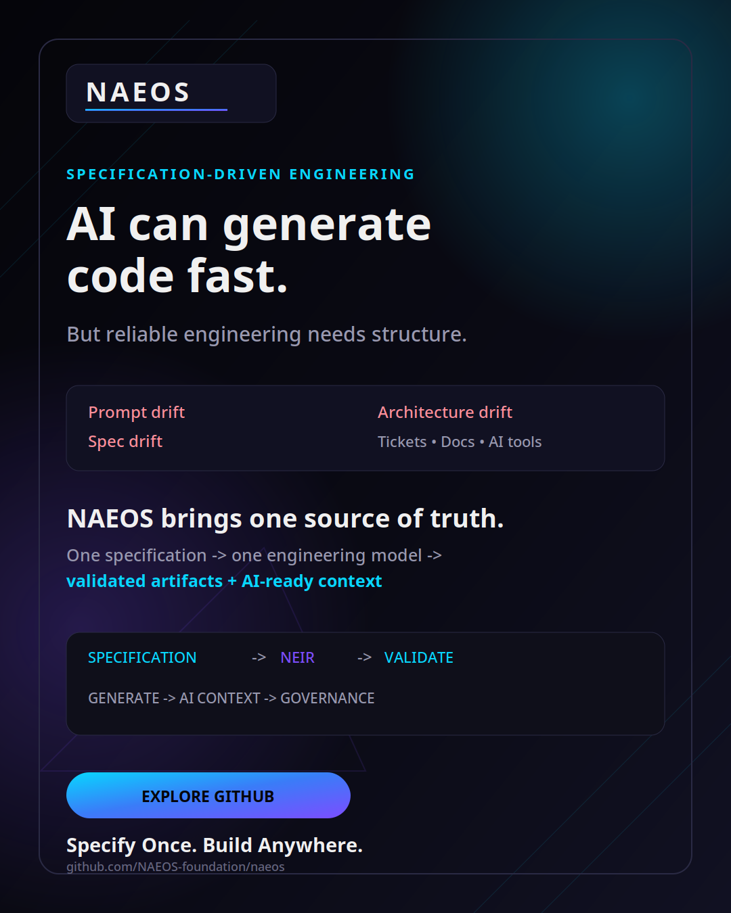

<div align="center">

<h1>NAEOS</h1>

<p><strong>Nusantara Engineering &amp; Architecture Operating System</strong></p>

<p>
  <em>Specify once. Build anywhere.</em>
</p>

<p>
  <a href="https://github.com/NAEOS-foundation/naeos/actions/workflows/ci.yml">
    
  </a>
  <a href="https://go.dev">
    
  </a>
  <a href="LICENSE">
    
  </a>
  <a href="https://github.com/NAEOS-foundation/naeos/releases">
    
  </a>
</p>

</div>

NAEOS is a declarative engineering platform that transforms software specifications into validated, extensible engineering workflows. It provides a consistent model for defining, generating, governing, and evolving software systems.

Unlike a project generator, NAEOS maintains an engineering model throughout the lifecycle: it parses specifications, builds **NEIR** (NAEOS Engineering Intermediate Representation), validates dependencies and policies, orchestrates execution, generates artifacts, and compiles context for AI development tools.

## Contents

- [Vision](#vision)
- [How NAEOS works](#how-naeos-works)
- [Quick start](#quick-start)
- [Demo](#demo)
- [Capabilities](#capabilities)
- [Architecture](#architecture)
- [Core components](#core-components)
- [CLI commands](#cli-commands)
- [Repository structure](#repository-structure)
- [Documentation](#documentation)
- [Roadmap](#roadmap)
- [Contributing](#contributing)
- [License](#license)

## Vision

NAEOS aims to help developers and organizations describe a system once, then build, validate, and evolve it across languages, frameworks, and platforms through an open-source engineering platform.

## How NAEOS works

```text
Specification
     │
     ▼
Parse → Normalize → Resolve → Build NEIR → Validate
                                             │
                                             ▼
                                  Schedule → Generate
                                             │
                                             ▼
                           AI context · Governance · Artifacts
```

The specification is the source of truth. NAEOS turns it into a structured engineering model that can be consumed by validation, generation, governance, documentation, and AI tooling.

## Project guides

- [Marketing strategy](MARKETING-STRATEGY.md) — evidence-based positioning, content calendar, funnel, and experiments.
- [Marketing experiment template](.github/ISSUE_TEMPLATE/marketing_experiment.md) — record campaign hypotheses, metrics, results, and learnings.
- [Marketing assets](brand/marketing/) — posts, scripts, video demo, and backlog for social campaigns.

## Social posting scripts

Scripts in `scripts/` publish announcement content to community channels. Credentials (tokens) live in the gitignored `.env`; never commit them.

| Script | Purpose | Env vars | Example |
|---|---|---|---|
| [`scripts/linkdin-post.sh`](scripts/linkdin-post.sh) | Post to the personal LinkedIn feed (Posts API, public) | `LINKEDIN_ACCESS_TOKEN`, `LINKEDIN_URN` | `./scripts/linkdin-post.sh --file brand/marketing/linkedin-post-cli-demo.md` |
| [`scripts/social-post.sh`](scripts/social-post.sh) | Post today's `brand/marketing/content-calendar.json` entry to Discord/Slack/LinkedIn | `DISCORD_TOKEN`, `DISCORD_ANNOUNCE_CHANNEL`, `NAEOS_SLACK_TOKEN`, `NAEOS_SLACK_ANNOUNCE_CHANNEL`, `LINKEDIN_ACCESS_TOKEN`, `LINKEDIN_URN` | `./scripts/social-post.sh --dry-run --date 2026-09-10` |

The content calendar lives at [`brand/marketing/content-calendar.json`](brand/marketing/content-calendar.json) (date → platforms → message per channel). The [`social-post.yml`](.github/workflows/social-post.yml) workflow runs it automatically at 07:30 UTC daily; the required values are supplied as GitHub repository secrets (`DISCORD_TOKEN`, `DISCORD_ANNOUNCE_CHANNEL`, `NAEOS_SLACK_TOKEN`, `NAEOS_SLACK_ANNOUNCE_CHANNEL`, `LINKEDIN_ACCESS_TOKEN`, `LINKEDIN_URN`).

All scripts support `--dry-run` to preview the payload without publishing. `social-post.sh` also guards against duplicate posts (retries failed sends up to 3 times, logs every post to `.social-post.log`, and skips dates/platforms already sent), plus `--show-log` / `--reset-log` for inspecting or clearing that log.

## Quick start

```bash
# Clone and build
git clone https://github.com/NAEOS-foundation/naeos.git
cd naeos
go build ./cmd/naeos/

# Create a specification
cat > spec.yaml << 'EOF'
project: my-app
modules:
  - name: auth
    path: ./auth
  - name: api
    path: ./api
    dependencies: [auth]
services:
  - name: gateway
    kind: http
    port: 8080
architecture:
  pattern: hexagonal
generation:
  languages: [go, typescript]
EOF

# Initialize configuration and run the pipeline
naeos init
naeos run --input-file spec.yaml

# Generate AI context
naeos context --input-file spec.yaml

# Compile instructions for an AI tool
naeos ai compile --input-file spec.yaml --target opencode
```

The example above demonstrates the core workflow: define a specification, run validation and orchestration, generate an AI context bundle, and compile instructions for a target AI tool.

### Requirements

- Go 1.25 or later
- Git

### Run the local CLI demo

Run the complete local demo (validate → context → generate):

```bash
go build -o naeos ./cmd/naeos
./examples/demo-cli/run-demo.sh
```

See [`examples/demo-cli/README.md`](examples/demo-cli/README.md) for output
location and optional AI compiler usage.

## Demo

<p align="center">
  <a href="brand/marketing/naeos-terminal-demo-en.mp4">
    
  </a>
</p>

<p align="center">
  <a href="https://youtu.be/C9QDlUqqaaI">
    
  </a>
</p>

- [Watch the NAEOS demo on YouTube](https://youtu.be/C9QDlUqqaaI)

- English terminal demo — [`naeos-terminal-demo-en.mp4`](brand/marketing/naeos-terminal-demo-en.mp4)
- Indonesian terminal demo — [`naeos-terminal-demo-id.mp4`](brand/marketing/naeos-terminal-demo-id.mp4)
- 30-second cuts — [`naeos-demo-30s.mp4`](brand/marketing/naeos-demo-30s.mp4) and [`naeos-demo-en-30s.mp4`](brand/marketing/naeos-demo-en-30s.mp4)

The poster and local videos are available in [`brand/marketing/`](brand/marketing/).

## Capabilities

### Core Pipeline
- **Parser** — YAML/JSON specification parsing with variable interpolation
- **Normalizer** — data normalization
- **Resolver** — cross-reference resolution
- **NEIR Builder** — unified project model
- **Validator** — comprehensive validation (circular deps, port conflicts, module boundaries)
- **Scheduler** — DAG-based task scheduling
- **Generator** — multi-language code generation (Go, TypeScript, Python, Java, Rust)

### Spec Language v2
- `${var}` — variable interpolation
- `$env{VAR}` — environment variable resolution
- `$ref{path}` — cross-reference resolution
- `$include{file}` — multi-file spec composition
- `$fn{name(args)}` — custom functions (upper, lower, slug, default, len, coalesce)
- `$if{condition}` / `$endif` — conditional sections
- Schema versioning with auto-check (minimum v0.1.0)

### AI Integration
- **Compiler** — transform NEIR into AI instruction sets
- **7 Output Adapters**:
  - GitHub Copilot — `.github/copilot-instructions.md`
  - Claude Code — `CLAUDE.md`
  - Cursor — `.cursorrules`
  - Gemini CLI — `.gemini/CONFIG.md`
  - Codex — `AGENTS.md`
  - OpenCode — `AGENTS.md`
  - Windsurf — `.windsurfrules`
- **MCP Server** — Model Context Protocol for AI agent integration
- **Context Bundles** — LLM-optimized project summaries

### Marketplace
- **Profile Marketplace** — publish, search, download industry profiles
- **Plugin Marketplace** — install, uninstall, search plugins
- **6 Built-in Profiles**: SaaS, AI Agent, FinTech, Healthcare, Education, Government

### Governance
- **Policy Evaluator** — 9 operators, 5 default rules
- **Artifact Review** — governance rules
- **Audit Trail** — traceability

### Developer tools
- **200+ CLI Commands** — run, validate, compile, context, test, docgen, mcp, marketplace, serve, sign, helm, sbom, airgap, evidence, verify, policy, control, etc.
- **Watch Mode** — hot-reload pipeline on spec changes
- **Diff Engine** — compare specs with colorized output
- **Migration Engine** — schema version transforms (v0.1→v0.2→v0.3)
- **Testing Framework** — multi-language test runner
- **Documentation Generator** — auto-generate API/module docs
- **Benchmarks & Fuzz Testing** — performance and robustness
- **Docker** — multi-stage Dockerfile

## Architecture

```text
┌─────────────────────────────────────────────────────────┐
│                    NAEOS Architecture                     │
├─────────────┬──────────────┬──────────────┬─────────────┤
│    Input    │  Core Layer  │  Generation  │   Output    │
├─────────────┼──────────────┼──────────────┼─────────────┤
│  Spec YAML  │   Parser     │   Generator  │  Code Files │
│  CLI cmds   │   Normalizer │   Adapters   │  Configs    │
│  Profiles   │   Resolver   │   Renderers  │  Docs       │
│  Context    │   Validator  │   Compiler   │  AI Context │
│             │   Scheduler  │   Profiles   │  Artifacts  │
│             │   Kernel     │              │             │
│             │   Policy     │              │             │
│             │   Review     │              │             │
└─────────────┴──────────────┴──────────────┴─────────────┘
```

## Core components

### Kernel
The kernel provides the runtime foundation:
- Service Registry
- Event Bus (pub/sub)
- Telemetry Collection
- Lifecycle Management

### Specification
Specifications use NAEOS Specification Language v2 as the single source of truth.

### NEIR
NAEOS Engineering Intermediate Representation is the central engineering model representing the entire system. NEIR encompasses project, architecture, domain, module, component, service, API, storage, infrastructure, security, AI, documentation, deployment, testing, and metadata.

### Compiler
The compiler transforms NEIR into AI instruction sets for 7 target tools.

### Marketplace
A marketplace for profiles, plugins, and templates that can be published, searched, and installed.

## CLI Commands

| Command | Description |
|---------|-------------|
| `naeos run` | Execute full pipeline |
| `naeos validate` | Validate specification |
| `naeos compile` | Compile to AI instruction sets |
| `naeos context` | Generate AI context bundle |
| `naeos test` | Run tests for generated code |
| `naeos docgen` | Generate documentation |
| `naeos mcp` | Start MCP server |
| `naeos marketplace` | Browse marketplace |
| `naeos profile` | Manage industry profiles |
| `naeos artifacts` | Manage artifact store |
| `naeos migrate` | Schema migration |
| `naeos doctor` | System health check |
| `naeos diff` | Compare specifications |
| `naeos watch` | Watch for changes |
| `naeos init` | Initialize config |
| `naeos create` | Create project |
| `naeos scaffold` | Generate scaffold |
| `naeos export` | Export artifacts |
| `naeos audit` | Audit specification |
| `naeos kernel` | Inspect kernel |
| `naeos plugin` | Manage plugins |
| `naeos template` | Manage templates |
| `naeos workspace` | Manage workspace |
| `naeos rollback` | Rollback changes |
| `naeos repair` | Repair specification |
| `naeos status` | Pipeline status |
| `naeos ai` | AI assistance |
| `naeos docs` | Documentation |
| `naeos lock` | Lock dependencies |
| `naeos version` | Version info |
| `naeos completion` | Shell completion |

## Repository Structure

```text
cmd/naeos/           # CLI commands (200+ commands)
internal/
  specification/     # Parser, normalizer, resolver
  neir/             # NEIR model and builder
  compiler/         # AI instruction compiler
  context/          # Context bundle generator
  generation/       # Code generation
  governance/       # Policy and review
  artifacts/        # Artifact store
  profiles/         # Industry profiles
  marketplace/      # Profile & plugin marketplace
  migration/        # Schema migration
  mcp/              # MCP server
  testrunner/       # Test framework
  docgen/           # Documentation generator
  diff/             # Diff engine
  watch/            # File watcher
  security/         # Security rules
  knowledge/        # Knowledge graph
  database/         # Database layer (PostgreSQL, MySQL, SQLite)
  websocket/        # WebSocket real-time communication
  eventsourcing/    # Event sourcing and aggregate snapshots
  distributed/      # Distributed task execution
  configreload/     # Configuration hot-reload
  configprovider/   # Config providers (env, file, K8s secret, Vault)
  pipelinecache/    # Pipeline result caching
  pipelinemiddleware/ # Composable pipeline middleware
  audit/            # Audit logging layer
  hcl/              # HCL configuration parser
  profiledetect/    # Automatic language/framework detection
  ai/               # AI service and LLM integration
  pluginsdk/        # Plugin SDK with WASM runtime
  serve/            # Production server daemon
  sbom/             # SBOM generation (CycloneDX)
  signing/          # Artifact signing (Ed25519)
  verification/     # Independent verification
  evidence/         # Immutable evidence store
  helm/             # Helm chart scaffolding
  airgap/           # Air-gapped bundles
  runtime/          # Runtime execution gateway
pkg/
  pipeline/         # Main pipeline
  kernel/           # System kernel
  config/           # Configuration
  plugin/           # Plugin system
docs/               # Documentation (57 NES specs)
```

## Documentation

- [WHITEPAPER-EN.md](WHITEPAPER-EN.md) — official whitepaper (English)
- [WHITEPAPER.md](WHITEPAPER.md) — whitepaper resmi (Bahasa Indonesia)
- [DOCUMENTATION-INDEX.md](DOCUMENTATION-INDEX.md) — document index
- [GETTING-STARTED.md](GETTING-STARTED.md) — onboarding guide
- [CONTRIBUTING.md](CONTRIBUTING.md) — contribution guidelines
- [CHANGELOG.md](CHANGELOG.md) — version history
- [docs/](docs/) — 57 NES specification documents (NES-000 to NES-054, including Kernel API and NEIR Model references)

## Roadmap

### Completed
- [x] v0.1.0 — Foundation (parser, NEIR, pipeline, CLI)
- [x] v0.2.0 — Compiler Foundation (6 adapters, artifact store, profiles)
- [x] v0.3.0 — Core Specification (Spec v2, validation, context bundles)
- [x] v0.4.0 — MCP Server, migration engine, marketplace, benchmarks
- [x] v1.0.0 — Stable release (test coverage, security hardening, 200+ commands)
- [x] v1.1.0 — Critical fixes (WebSocket races, interface{}→any, godoc, OpenAPI)
- [x] v1.2.0 — Database layer (PostgreSQL/MySQL/SQLite, retry, logging, health checks)
- [x] v1.3.0 — Quality, Correctness & Production Readiness (code gen fixes, security audit, CLI --output json/yaml)
- [x] v1.3.1 — Code Quality & Lint Compliance (999 issues resolved, 22 unused symbols removed)
- [x] v1.4.0 — Prompt Library & Platform Improvements (YAML templates, observability dashboard, workflow manager)
- [x] v1.5.0 — Production Hardening (HTTP timeouts, context propagation, error logging, SSE fixes, test fixes)
- [x] v2.1.0 — RBAC, multi-tenant workspaces, schema registry API, industry profiles, compliance export
- [x] v2.2.0 — Supabase backend integration, lint zero-failure, fuzz testing, coverage-gated CI
- [x] v3.0.0 — Pipeline profiling, stage caching, schema-based validation, NEIR-aware LSP server, official plugin examples
- [x] v3.1.0 — Pipeline caching on `naeos run`, run-level profiling (`--profile`/`--pprof`), architecture patterns, WASM plugin hardening
- [x] v3.2.0 — Production server daemon (`naeos serve`), TLS, graceful shutdown, systemd integration
- [x] v3.3.0 — SBOM generation (CycloneDX), Ed25519 artifact signing, SBOM verifier
- [x] v3.4.0 — Helm chart scaffolding, air-gapped bundles, config providers

For upcoming work, see [DEVELOPMENT_PLAN.md](DEVELOPMENT_PLAN.md) and [ROADMAP.md](ROADMAP.md).

## Contributing

Contributions, documentation improvements, issue reports, and new integrations are welcome. Start with the [contribution guidelines](CONTRIBUTING.md), then review the [getting started guide](GETTING-STARTED.md) and open an issue or pull request.

## License

NAEOS is released under the [Apache License 2.0](LICENSE).

## Status

**Active development** — The latest documented release is v3.4.0, which includes Helm chart scaffolding, air-gapped bundles, and configuration providers. See the [release history](CHANGELOG.md) for details.
