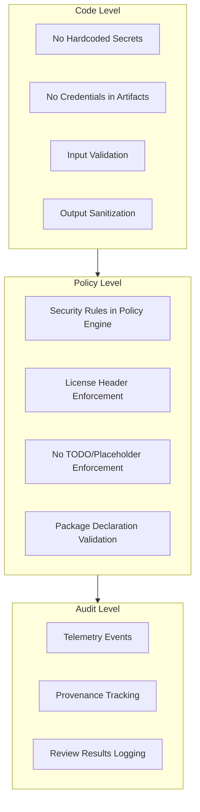
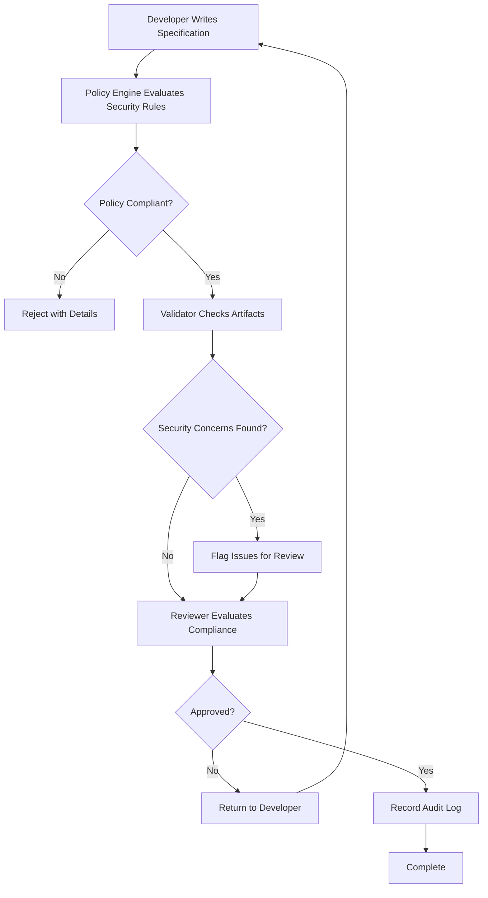

# NES-020 Security

## 1. Status
- Status: Draft
- Version: 0.2
- Owner: NAEOS Core Team

## 2. Purpose
This specification defines the security controls, audit mechanisms, and security principles for the NAEOS ecosystem.

## 3. Scope
The security layer covers access control, audit logging, secret management, and security policy enforcement.

## 4. Requirements
### 4.1 Functional Requirements
- FR-001: NAEOS shall enforce access control on sensitive operations.
- FR-002: All security-relevant actions shall be logged for audit.
- FR-003: Secrets and keys shall never be exposed in generated artifacts.
- FR-004: Security policies shall be enforceable through the policy engine.

### 4.2 Non-Functional Requirements
- NFR-001: Security controls shall be auditable and traceable.
- NFR-002: Security policies shall follow defense-in-depth principles.

## 5. Security Model

### 5.1 Principles

| Principle | Deskripsi |
|-----------|-----------|
| Least Privilege | Berikan akses minimum yang diperlukan |
| Defense in Depth | Multiple layers of security |
| Audit Trail | Semua aksi sensitif tercatat |
| No Secrets in Code | Tidak ada secret dalam kode atau artefak |
| Validate Input | Semua input harus divalidasi |

### 5.2 Security Controls



#### Code Level
- Tidak ada hardcoded secrets
- Tidak ada credential dalam generated artifacts
- Input validation pada semua entry points
- Sanitization pada output

#### Policy Level
- Security rules dalam policy engine
- License header enforcement
- No TODO/placeholder enforcement
- Package declaration validation

#### Audit Level
- Telemetry events untuk security actions
- Provenance tracking untuk semua artefak
- Review results tercatat

### 5.3 Policy Rules

| Rule | Scope | Action |
|------|-------|--------|
| no-hardcoded-secrets | code | reject |
| license-header-required | code | reject |
| no-todo-in-production | code | reject |
| input-validation | code | warn |

## 6. RBAC (Role-Based Access Control)

### 6.1 Role Model

RBAC is implemented in `internal/auth/rbac.go` with support for role hierarchy and deny overrides:

```go
type Role struct {
    Name        string
    Permissions map[string][]string // resource → actions
    Parents     []string             // inherited roles
    Deny        map[string][]string  // resource → denied actions (override)
}
```

| Feature | Description |
|---------|-------------|
| Hierarchy | `Parents` chains allow inheritance (e.g., admin → dev → viewer) |
| Deny override | `Deny` rules always win over inherited allow rules |
| Resolution | `hasPermissionRecursive()` walks parent chain depth-first |
| Templates | `SetupRoleTemplate()` provides compliance-ready roles |

### 6.2 Built-in Role Templates

| Template | Description |
|----------|-------------|
| `auditor` | Read-only access to audit logs and compliance |
| `soc2_auditor` | SOC2-specific: audit + compliance + report access |
| `gdpr_admin` | GDPR: user data management + deletion + export rights |
| `hipaa_admin` | HIPAA: PHI access + audit log + incident response |

### 6.3 CLI

```
naeos auth create-role <name> --permissions <map> --parents <list> --deny <map>
naeos auth assign-role <role> <user>
naeos auth create-role-from-template <template> <name>
naeos auth list-role-templates
```

## 7. SSO (Single Sign-On)

### 7.1 Provider Architecture

SSO is implemented in `internal/auth/sso.go` and supports three provider types:

| Provider | Protocol | Auth Method |
|----------|----------|-------------|
| OIDC | OpenID Connect | Authorization code flow + JWKS signature verification |
| SAML | SAML 2.0 | HTTP POST binding, XML response parsing |
| LDAP | LDAP v3 | Simple bind, ASN.1 BER search |

All implementations are **zero external dependency** (stdlib only).

### 7.2 OIDC Provider

```go
provider := NewOIDCProvider(SSOConfig{
    Name:         "google",
    Issuer:       "https://accounts.google.com",
    ClientID:     "...",
    ClientSecret: "...",
    RedirectURL:  "http://localhost:8080/callback",
    Scopes:       []string{"openid", "email", "profile"},
})
```

- Fetches OpenID Discovery document from `/.well-known/openid-configuration`
- Validates ID token signatures via JWKS (RSA PKCS1v15 with SHA-256)
- Supports authorization code exchange and userinfo endpoint

### 7.3 SAML Provider

```go
provider := NewSAMLProvider(SSOConfig{
    Name:     "okta",
    SSOURL:   "https://okta.example.com/saml/sso",
    EntityID: "https://sp.example.com",
    CertFile: "/path/to/cert.pem",
})
```

- Parses base64-decoded XML SAML Response
- Extracts NameID (user identifier) and SAML attributes (email, displayName, uid)
- Validates StatusCode for Success/Failure

### 7.4 LDAP Provider

```go
provider := NewLDAPProvider(SSOConfig{
    Name:       "corp-ldap",
    Host:       "ldap.corp.example.com",
    Port:       389,
    BaseDN:     "dc=corp,dc=example,dc=com",
    BindDN:     "cn=admin,dc=corp,dc=example,dc=com",
    UserFilter: "(uid=%s)",
})
```

- Simple BIND authentication over TCP (or TLS on port 636)
- ASN.1 BER encoded search requests and response parsing
- Configurable attribute mapping (uid → id, cn → name, mail → email)

### 7.5 SSO Registry

```go
m := auth.NewManager()
m.SSO().Register(provider)
m.SSO().Get("google")
m.SSO().List()
m.SSO().Remove("google")
```

Config is persisted to `~/.config/naeos/sso.json`.

## 8. Workflow



1. Developer menulis spesifikasi dengan security requirements.
2. Policy engine mengevaluasi security rules.
3. Validator memeriksa artefak untuk security concerns.
4. Reviewer mengevaluasi security compliance.
5. Audit log dicatat untuk setiap security decision.

## 9. Acceptance Criteria
- No secrets are exposed in generated artifacts.
- All security-relevant actions are logged.
- Security policies are enforceable through the policy engine.
- Audit trail is complete and traceable.
- RBAC roles support hierarchy inheritance with deny override.
- SSO providers (OIDC, SAML, LDAP) authenticate users correctly.
- Role templates provide compliance-ready configurations.
