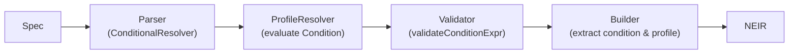
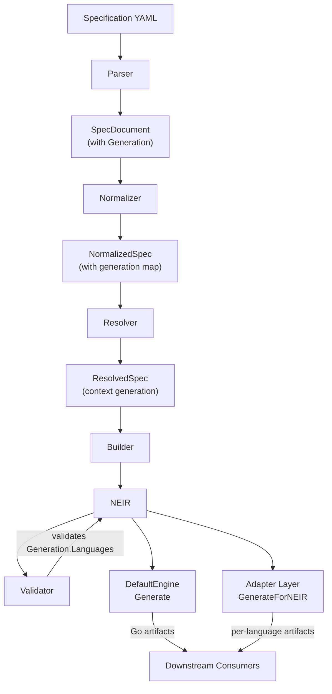

# NES-023 — NEIR (Nusantara Enterprise Intermediate Representation)

## 1. Status
- Status: Stable
- Version: 2.0.0
- Owner: NAEOS Core Team
- Last Updated: 2026-07-25

## 2. Purpose
This specification defines NEIR as the canonical engineering intermediate representation for the NAEOS platform. NEIR is the single source of truth that all downstream engines (planner, generator, validator, adapter) consume.

## 3. Scope
This document covers the role of NEIR in the pipeline, its internal model structure, versioning model, generation config, and its use by planner, generator, validator, adapter, and runtime.

## 4. Normative References
- NES-000 Foundation
- NES-007 Generator
- NES-011 Graph
- NES-012 Policy
- NES-019 SDK
- NES-040 Output Adapter Architecture

## 5. Definitions
- NEIR: The complete engineering model that represents the target system independently of syntax or transport format.
- Canonical Model: The authoritative internal representation used by downstream engines.
- Generation Config: Configuration within NEIR that specifies target languages and output directories for multi-language SDK generation.

## 6. NEIR Core Model

NEIR shall contain the following domains:

```go
type NEIR struct {
    Project        *project.Project
    Architecture   *architecture.Architecture
    Domain         *domain.Domain
    Modules        []module.Module
    Components     []component.Component
    Services       []service.Service
    APIs           []api.API
    Storage        []storage.Storage
    Infrastructure *infrastructure.Infrastructure
    Security       *security.Security
    AI             *ai.AI
    Documentation  *docs.Documentation
    Deployment     *deployment.Deployment
    Testing        *testingmodel.Testing
    Metadata       *metadata.Metadata
    Generation     *GenerationConfig
}
```

### 6.1 GenerationConfig

```go
type GenerationConfig struct {
    Languages []language.Language  // target languages for SDK generation
    OutputDir string               // output directory override
    ModuleDir string               // module directory override
}
```

GenerationConfig is populated from the `generation:` section of the spec YAML or overridden via CLI `--language` flag.

### 6.2 NEIR v2.0 — Conditional Modules & Inheritance

NEIR v2.0 adds support for conditional modules/services and environment profile inheritance:

```go
// Module and Service now include:
type Module struct {
    // ...
    Condition string `yaml:"condition,omitempty"` // e.g. "env('prod')"
}

type Service struct {
    // ...
    Condition string `yaml:"condition,omitempty"` // e.g. "has_prefix(env('stage'), 'staging')"
}

// NEIR model includes profile configuration:
type NEIR struct {
    // ...
    ActiveProfile string   // resolved profile name
    Inherits      []string // inherited profile chain
    
    // Profile-scoped variables per environment
    // Deployment.environments[].variables
}
```

The `$if{}/$endif` directive in spec YAML is resolved by `ConditionalResolver` during parsing.
The `ProfileResolver` evaluates `Condition` fields against env vars and filters modules/services:



### 6.3 Domain Descriptions

| Domain | Description |
|--------|-------------|
| Project | Project identity, name, description |
| Architecture | Architecture pattern, tech stack, principles |
| Domain | Domain model, bounded contexts |
| Module | Source modules with paths, dependencies, optional `Condition` |
| Component | Reusable components |
| Service | Services with kind, port, dependencies, optional `Condition` |
| API | API contracts, endpoints |
| Storage | Database, cache, blob storage |
| Infrastructure | Cloud, networking, DNS, CDN |
| Security | Security policies, auth, secrets |
| AI | AI models, pipelines, vector stores |
| Documentation | Docs, ADRs, guides |
| Deployment | Strategy, environment, scaling, variables per environment |
| Testing | Test strategy, coverage targets |
| Metadata | Ownership, versioning, tags |
| Generation | Target languages, output config |

## 7. Pipeline Integration



```
Specification YAML
       │
       ▼
   Parser ──→ SpecDocument (with Generation)
       │
       ▼
   Normalizer ──→ NormalizedSpec (with generation map)
       │
       ▼
   Resolver ──→ ResolvedSpec (context["generation"])
       │
       ▼
   Builder ──→ NEIR (with Generation populated)
       │
       ├──→ Validator validates Generation.Languages
       │
       ├──→ DefaultEngine.Generate(NEIR) → Go artifacts
       │
       └──→ adapters.GenerateForNEIR(NEIR) → per-language artifacts
```

### 7.1 Pipeline Steps

1. Specification is parsed into structured input (SpecDocument).
2. Normalizer transforms input into NormalizedSpec (including generation config).
3. Resolver resolves references and applies defaults.
4. Builder constructs NEIR from resolved spec.
5. Planner consumes NEIR to derive an execution graph.
6. Validator checks NEIR model including Generation.Languages.
7. DefaultEngine generates Go-centric boilerplate from NEIR.
8. Adapter Layer dispatches to language-specific adapters based on NEIR.Generation.Languages.
9. Reviewer reviews all generated artifacts.
10. Runtime executes artifacts while preserving the NEIR lineage.

## 8. Versioning Model

NEIR shall include version metadata:
- `neirVersion` — version of the NEIR schema
- `schemaVersion` — version of the input specification schema
- `projectVersion` — version of the project being represented

This ensures forward and backward compatibility across evolution of the model.

## 9. Language Resolution

The pipeline determines target languages using this resolution order:

1. CLI `--language` flag (highest priority override)
2. `generation.languages` from spec YAML
3. Default: `["go"]`

If a language is not recognized by any registered adapter, it is skipped silently.

## 10. Adapter Integration

NEIR serves as the sole input for all output adapters:

```
NEIR
  │
  ├──→ GoAdapter (language: go)
  │     Input: NEIR.Project.Name, NEIR.Modules, NEIR.Services, NEIR.Generation
  │     Output: go.mod, handler.go, service.go, Dockerfile, ci.yml, ...
  │
  ├──→ TypeScriptAdapter (language: typescript)
  │     Input: same NEIR
  │     Output: package.json, index.ts, handler.ts, Dockerfile, ci.yml, ...
  │
  ├──→ PythonAdapter (language: python)
  │     Input: same NEIR
  │     Output: pyproject.toml, __init__.py, handler.py, Dockerfile, ci.yml, ...
  │
  ├──→ JavaAdapter (language: java)
  │     Input: same NEIR
  │     Output: pom.xml, Handler.java, Service.java, Dockerfile, ci.yml, ...
  │
  └──→ RustAdapter (language: rust)
        Input: same NEIR
        Output: Cargo.toml, lib.rs, handler.rs, Dockerfile, ci.yml, ...
```

All adapters are independent — no inter-adapter dependencies. They all consume the same NEIR and produce language-specific artifacts.

## 11. Conditional Resolution (v2.0)

### 11.1 Condition Expressions

Modules and services can declare a `condition` string evaluated at resolver time:

| Expression | Description |
|------------|-------------|
| `env('VAR')` | Returns value of environment variable `VAR` |
| `eq(a, b)` | String equality check |
| `has_prefix(s, prefix)` | True if `s` starts with `prefix` |
| `true` / `false` | Literal boolean |

Conditions support logical operators through `$if{}/$endif` in spec YAML:

```yaml
modules:
  - name: payment-gateway
    path: ./payment
    $if{ env('FEATURE_PAYMENT') == 'true' }:
      condition: "env('FEATURE_PAYMENT')"
  - name: analytics
    path: ./analytics
    $if{ has_prefix(env('STAGE'), 'prod') }:
      condition: "has_prefix(env('STAGE'), 'prod')"
```

### 11.2 Profile Inheritance

Profiles can inherit configuration from parent profiles:

```yaml
profiles:
  base:
    variables:
      LOG_LEVEL: info
  production:
    inherits: [base]
    variables:
      LOG_LEVEL: debug
```

The `ProfileResolver`:
1. Sets `ActiveProfile` on NEIR model
2. Populates `Inherits` chain
3. Filters modules/services where `Condition` evaluates to false
4. Cleans up dependency references to filtered modules
5. Merges variables from inherited profiles

### 11.3 Validator Integration

The `Validator` checks condition expressions during validation:

```go
func validateConditionExpr(expr string) error
```

Returns error for empty expressions or invalid function calls.

## 12. Requirements

### 12.1 Functional Requirements
- FR-001: NEIR shall serve as the canonical input for planning and generation.
- FR-002: NEIR shall represent all major engineering concerns of a project.
- FR-003: NEIR shall preserve traceability to the originating specification.
- FR-004: NEIR shall include GenerationConfig for multi-language SDK generation.
- FR-005: NEIR shall be consumed by both DefaultEngine and Adapter Layer.

### 12.2 Non-Functional Requirements
- NFR-001: NEIR shall remain extensible as new domains are introduced.
- NFR-002: NEIR shall support deterministic serialization and validation.
- NFR-003: NEIR shall be language-agnostic — adapters must not depend on NEIR implementation language.

## 13. Acceptance Criteria
- A planner can derive an execution graph from NEIR without parsing raw source syntax.
- A generator can create implementation artifacts directly from NEIR.
- A validator can evaluate generated output against the NEIR model.
- An adapter can generate language-specific artifacts from NEIR without understanding the original specification format.
- Multiple adapters can run in parallel on the same NEIR instance.

## 14. Related Documents

| ID | Document |
|----|----------|
| NES-000 | Foundation |
| NES-007 | Generator |
| NES-011 | Graph |
| NES-012 | Policy |
| NES-019 | SDK |
| NES-026 | Pipeline |
| NES-039 | SDK Multi-Language |
| NES-040 | Output Adapter Architecture |

## Revision History

| Version | Date | Change |
|---------|------|--------|
| 0.1 | 2026-07-09 | Initial NEIR specification |
| 1.0.0 | 2026-07-10 | Added GenerationConfig, Language Resolution, Adapter Integration, expanded domain table |
| 2.0.0 | 2026-07-25 | Added conditional modules/services (`Condition` field), `ProfileResolver` with env var evaluation, profile inheritance (`Inherits`/`ActiveProfile`), `ConditionalResolver` for `$if{}/$endif` in parser, `validateConditionExpr` in validator, deployment environment variables |
