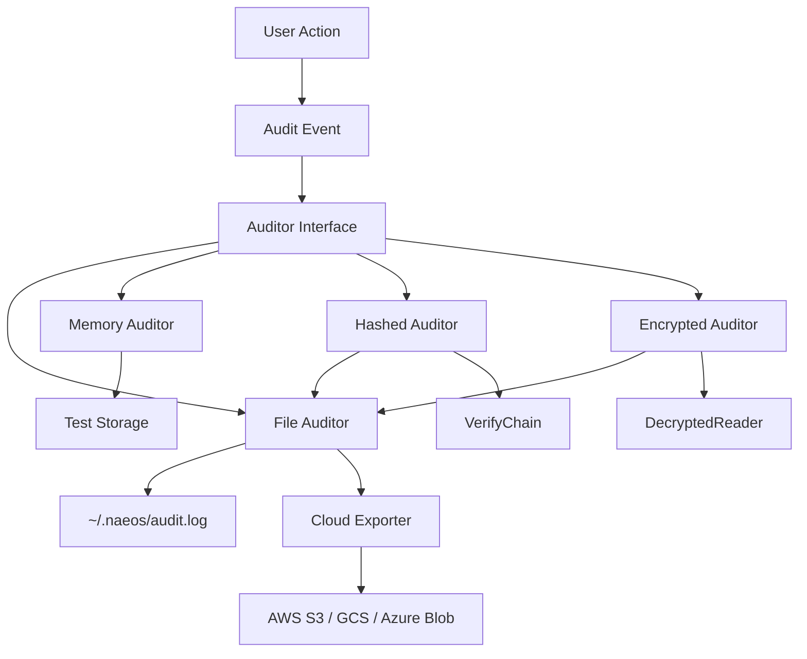

# NES-049 Audit Logging

## 1. Status
- Status: Stable
- Version: 1.0.0
- Owner: NAEOS Core Team

## 2. Purpose
This specification defines the audit logging layer for NAEOS, providing immutable audit trail for user actions, system events, and security-relevant operations with chain-of-custody verification, encryption, and cloud export.

## 3. Scope
The audit logging layer covers:
- Audit event structure
- File-based auditor for persistence
- In-memory auditor for testing
- Thread-safe event logging
- Event ID and timestamp generation
- Hashed auditor for tamper-evident chain (SHA-256 linked list)
- Encrypted auditor for at-rest confidentiality (AES-256-GCM)
- Cloud export to AWS S3, GCS, Azure Blob
- Chain verification and integrity checking

## 4. Requirements
### 4.1 Functional Requirements
- FR-001: System shall log all auditable actions.
- FR-002: Audit events shall include user, action, resource, and status.
- FR-003: Audit events shall have unique IDs and timestamps.
- FR-004: File auditor shall append to log file atomically.
- FR-005: In-memory auditor shall store events for testing.

### 4.2 Non-Functional Requirements
- NFR-001: Audit logging shall be thread-safe.
- NFR-002: Audit events shall be immutable once logged.
- NFR-003: Audit log files shall have restricted permissions (0600).
- NFR-004: Hashed chain shall detect any tampering with prior events.
- NFR-005: Encrypted auditor shall use authenticated encryption (AES-256-GCM).
- NFR-006: Cloud export shall support AWS SigV4, GCS HMAC, and Azure SharedKey signing.

## 5. Architecture



## 6. Core Types

### 6.1 AuditEvent

```go
type AuditEvent struct {
    ID         string    `json:"id"`
    Timestamp  time.Time `json:"timestamp"`
    UserID     string    `json:"user_id"`
    Action     string    `json:"action"`
    Resource   string    `json:"resource"`
    ResourceID string    `json:"resource_id,omitempty"`
    IP         string    `json:"ip,omitempty"`
    UserAgent  string    `json:"user_agent,omitempty"`
    Status     string    `json:"status"`
    Details    string    `json:"details,omitempty"`
}
```

### 6.2 Auditor Interface

```go
type Auditor interface {
    Log(event AuditEvent) error
}
```

## 7. File Auditor

```go
type FileAuditor struct {
    path string
    mu   sync.Mutex
}

func NewFileAuditor(homeDir string) (*FileAuditor, error)
func (f *FileAuditor) Log(event AuditEvent) error
```

| Feature | Description |
|---------|-------------|
| Location | `~/.naeos/audit.log` |
| Format | JSON Lines (one event per line) |
| Permissions | 0600 (owner read/write only) |
| Thread Safety | Mutex-protected |
| Auto-generate | ID and Timestamp if zero |

### File Format

```json
{"id":"evt-1234567890","timestamp":"2025-01-15T10:30:00Z","user_id":"admin","action":"compile","resource":"spec","status":"success"}
```

## 8. Memory Auditor

```go
type MemoryAuditor struct {
    events []AuditEvent
    mu     sync.Mutex
}

func NewMemoryAuditor() *MemoryAuditor
func (m *MemoryAuditor) Log(event AuditEvent) error
func (m *MemoryAuditor) Events() []AuditEvent
func (m *MemoryAuditor) Clear()
```

| Feature | Description |
|---------|-------------|
| Storage | In-memory slice |
| Thread Safety | Mutex-protected |
| Query | `Events()` returns copy |
| Reset | `Clear()` removes all events |

## 9. Hashed Auditor

```go
type HashedAuditor struct {
    inner Auditor
    mu    sync.Mutex
}

func NewHashedAuditor(inner Auditor) *HashedAuditor
func (h *HashedAuditor) Log(event AuditEvent) error
```

The `HashedAuditor` wraps any inner `Auditor` and computes a SHA-256 hash chain:

| Feature | Description |
|---------|-------------|
| Chain | Each event stores `PreviousHash` + `Hash` (SHA-256 of previous hash + current event) |
| First event | `PreviousHash` = SHA-256 of empty string |
| Tamper detection | `VerifyChain(events)` returns list of `ChainViolation` with index + reason |
| File verification | `VerifyChainFile(path)` reads JSONL file and verifies entire chain |
| Threat model | Detects modified/deleted/reordered events |

### Chain Verification

```go
type ChainViolation struct {
    Index  int
    Reason string
}

func VerifyChain(events []AuditEvent) []ChainViolation
func VerifyChainFile(path string) ([]ChainViolation, error)
```

## 10. Encrypted Auditor

```go
type EncryptedAuditor struct {
    inner Auditor
    key   []byte // derived from passphrase via SHA-256
}

func NewEncryptedAuditor(inner Auditor, passphrase string) *EncryptedAuditor
func NewEncryptedFileAuditor(homeDir, passphrase string) (*EncryptedAuditor, error)
func (e *EncryptedAuditor) Log(event AuditEvent) error
```

| Feature | Description |
|---------|-------------|
| Encryption | AES-256-GCM (authenticated encryption) |
| Key derivation | SHA-256 of passphrase |
| Nonce | Random 12-byte nonce per event |
| Output | Base64-encoded ciphertext stored by inner auditor |
| Decryption | `DecryptedReader` wraps file for transparent decryption |

### Decryption

```go
type DecryptedReader struct {
    file      *os.File
    passphrase string
}

func NewDecryptedReader(path, passphrase string) (*DecryptedReader, error)
func (r *DecryptedReader) ReadEvents() ([]AuditEvent, error)
```

## 11. Cloud Export

```go
type CloudExporter interface {
    Upload(key string, data []byte) error
    Type() string
}

type CloudConfig struct {
    Bucket      string
    Region      string
    AccessKey   string
    SecretKey   string
    AccountName string // Azure only
    AccountKey  string // Azure only
}

func NewS3Exporter(cfg CloudConfig) *S3Exporter         // AWS SigV4
func NewGCSExporter(cfg CloudConfig) *GCSExporter       // GOOG1 HMAC
func NewAzureBlobExporter(cfg CloudConfig) *AzureBlobExporter // SharedKey
func ExportToCloud(exporter CloudExporter, events []AuditEvent) error
```

| Provider | Auth Method | Endpoint Format |
|----------|-------------|-----------------|
| AWS S3 | SigV4 (HMAC-SHA256) | `https://{bucket}.s3.{region}.amazonaws.com/{key}` |
| GCS | GOOG1 HMAC | `https://storage.googleapis.com/{bucket}/{key}` |
| Azure Blob | SharedKey (HMAC-SHA256) | `https://{account}.blob.core.windows.net/{container}/{key}` |

All implementations use **zero external dependencies** — signing is done with stdlib `crypto/hmac` + `crypto/sha256`.

## 12. Event Fields

_See section 6.1 for struct definition._

| Field | Required | Description |
|-------|----------|-------------|
| `id` | Auto | Unique event identifier |
| `timestamp` | Auto | Event creation time |
| `user_id` | Yes | User who performed action |
| `action` | Yes | Action performed |
| `resource` | Yes | Resource affected |
| `resource_id` | No | Specific resource identifier |
| `ip` | No | Client IP address |
| `user_agent` | No | Client user agent |
| `status` | Yes | Action result (success/failure) |
| `details` | No | Additional details |

## 13. Usage Example

```go
// File auditor
auditor, err := audit.NewFileAuditor(os.Getenv("HOME"))
if err != nil {
    log.Fatal(err)
}

// Log event
err = auditor.Log(audit.AuditEvent{
    UserID:   "admin",
    Action:   "compile",
    Resource: "spec",
    Status:   "success",
})

// Memory auditor (testing)
memAuditor := audit.NewMemoryAuditor()
memAuditor.Log(audit.AuditEvent{
    UserID: "test",
    Action: "validate",
    Status: "success",
})
events := memAuditor.Events()
```

## 14. Integration Points

| Consumer | How It Uses AuditLogging |
|----------|-------------------------|
| `cmd/naeos/compile_cmd.go` | Logs compilation events |
| `cmd/naeos/db_cmd.go` | Logs database operations |
| `internal/api/server.go` | Logs API requests |

## 15. Acceptance Criteria
- [ ] Audit events are logged correctly.
- [ ] File auditor writes to correct location.
- [ ] File auditor uses correct permissions.
- [ ] In-memory auditor stores events correctly.
- [ ] Thread-safe access is maintained.
- [ ] Event IDs and timestamps are auto-generated.
- [ ] Hashed chain detects tampered events.
- [ ] Encrypted events are decryptable with correct passphrase.
- [ ] Cloud export produces correct HTTP signatures (SigV4, HMAC, SharedKey).
