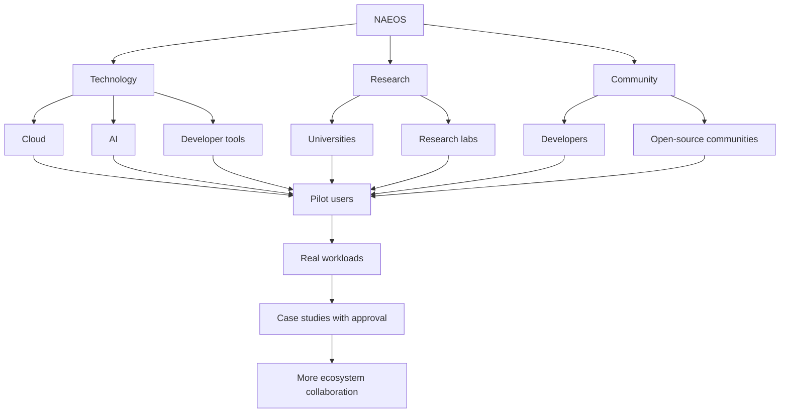

# NAEOS Partner Ecosystem

The ecosystem model starts with a small technical contribution and produces a reproducible integration or research result. It does not assume funding, credits, or a commercial outcome.

