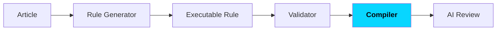
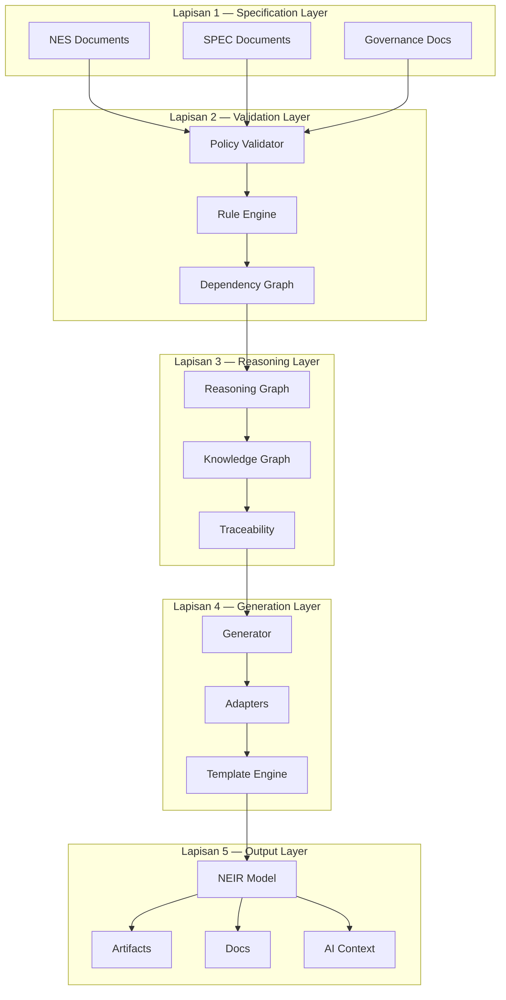
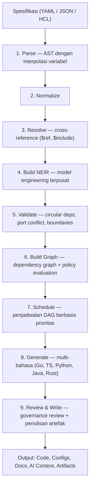
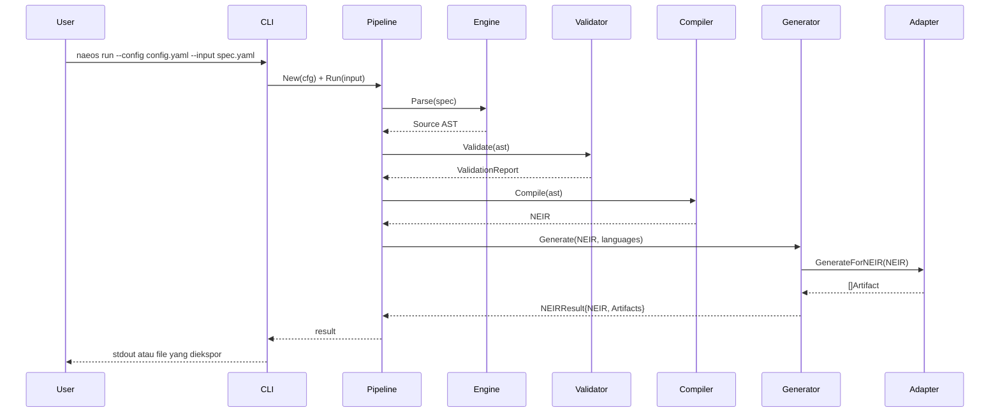
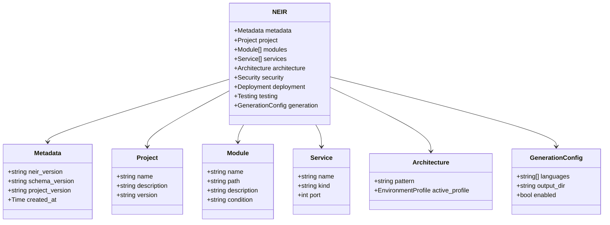
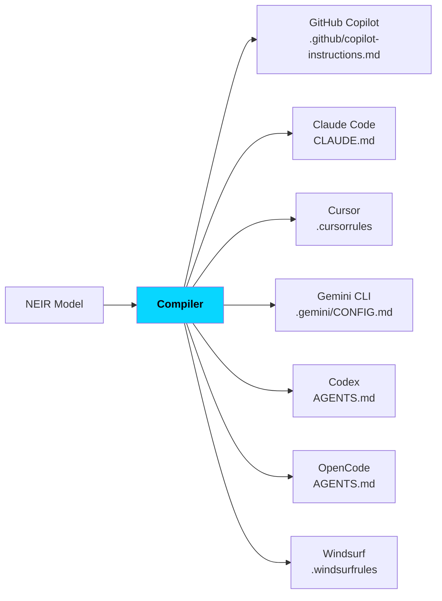

**Nusantara Engineering & Architecture Operating System**

> *"Specify Once. Build Anywhere."*

| | |
|---|---|
| **Versi Dokumen** | 1.0.0 |
| **Status** | Public Draft |
| **Lisensi Proyek** | Apache License 2.0 |
| **Repositori** | github.com/NAEOS-foundation/naeos |
| **Versi Platform** | v3.0.0 (rilis terbaru), aktif dikembangkan menuju v2.0.0 Dashboard & Distributed Builds |

---

## Ringkasan Eksekutif

NAEOS adalah platform engineering deklaratif open-source yang mengubah spesifikasi menjadi sistem perangkat lunak berkualitas tinggi melalui pipeline yang konsisten, tervalidasi, dan dapat diperluas. NAEOS bukan sekadar *project generator* — ia adalah *engineering runtime* yang memahami spesifikasi, membangun model internal (NEIR), mengorkestrasi rencana eksekusi, menghasilkan artefak, memvalidasi hasil, dan menjaga proyek tetap selaras dengan spesifikasinya sepanjang siklus hidup.

Dengan semboyan **"Specify Once. Build Anywhere."**, NAEOS memungkinkan organisasi mendeskripsikan sistem mereka **sekali**, lalu membangun, memvalidasi, dan mengevolusi perangkat lunak di berbagai bahasa, framework, dan platform — dengan jaminan *traceability* dari kebutuhan hingga deployment, serta integrasi mendalam dengan ekosistem AI coding agent.

Platform ini telah mencapai **v3.0.0** dengan ekosistem fitur yang mencakup spesifikasi bahasa v2, kompiler AI multi-adapter, LSP NEIR-aware, tata kelola berbasis konstitusi, marketplace, hingga kepatuhan enterprise (SOC 2, HIPAA, GDPR).

---

## 1. Latar Belakang & Pernyataan Masalah

### 1.1 Fragmentasi Software Engineering

Industri perangkat lunak menghadapi krisis fragmentasi yang sistemik:

- **Multi-bahasa, multi-framework** — Sebuah sistem tunggal kini melibatkan Go, TypeScript, Python, Java, dan Rust secara bersamaan, masing-masing dengan framework, konvensi, dan toolchain-nya sendiri.
- **Drift antara spesifikasi dan implementasi** — Dokumentasi dan kode berjalan menyimpang; tidak ada mekanisme otomatis yang menjamin keselarasan.
- **Kehilangan konteks engineering** — Keputusan arsitektur, ADR, dan pengetahuan organisasi hanya tersimpan di kepala individu, tidak terdokumentasi, dan tidak dapat ditelusuri.
- **Ledakan tooling AI** — Setiap AI coding agent (GitHub Copilot, Claude Code, Cursor, Gemini CLI, Codex, OpenCode) memiliki format konteks dan instruksi yang berbeda, memaksa organisasi memelihara banyak file konfigurasi yang identik isinya namun berbeda formatnya.
- **Ketidakkonsistenan tata kelola** — Tanpa mekanisme penegakan, kebijakan, standar, dan aturan organisasi tidak dieksekusi — hanya menjadi dokumen.

### 1.2 Biaya Ketidakkonsistenan

Dampak dari masalah di atas terukur secara langsung: pengerjaan ulang (*rework*), audit yang mahal, migrasi yang menyakitkan, *knowledge loss* saat anggota tim keluar, dan kesulitan memenuhi kepatuhan regulasi (SOC 2, HIPAA, GDPR) karena kurangnya bukti audit yang dapat diverifikasi.

### 1.3 Tesis

> **Spesifikasi adalah sumber kebenaran tunggal (*single source of truth*). Segala sesuatu — kode, dokumentasi, konfigurasi, konteks AI, artefak deployment — harus diturunkan dari spesifikasi melalui pipeline yang deterministik, tervalidasi, dan dapat diaudit.**

NAEOS dibangun untuk membuktikan tesis ini.

---

## 2. Visi & Misi

### Visi

Membangun platform engineering open-source yang memungkinkan developer dan organisasi **mendeskripsikan sistem mereka sekali**, kemudian membangun, memvalidasi, dan mengevolusi perangkat lunak di berbagai bahasa, framework, dan platform — dengan konstitusi engineering yang ditegakkan secara otomatis.

### Misi

1. Menjadikan spesifikasi deklaratif sebagai sumber kebenaran tunggal seluruh artefak engineering.
2. Menyediakan pipeline kompilasi yang deterministik, tervalidasi, dan dapat diaudit.
3. Menjembatani kesenjangan antara governance, spesifikasi, dan eksekusi melalui policy yang dapat dieksekusi.
4. Membangun jembatan universal menuju seluruh AI coding agent tanpa vendor lock-in.
5. Memberikan **voucher kedaulatan teknologi**: platform yang netral vendor, netral bahasa, dan netral cloud.

---

## 3. Prinsip Dasar: Engineering Constitution

NAEOS memformalkan prinsip-prinsipnya dalam **Engineering Constitution** (NAEOS-CON-001) — dokumen normatif tertinggi yang menjadi sumber aturan eksekusi. Hirarki normatifnya:

Dua belas pasal konstitusi:

| # | Pasal | Inti |
|---|-------|------|
| I | **Specification First** | Tanpa spesifikasi = tanpa implementasi |
| II | **Knowledge Preservation** | Seluruh keputusan engineering wajib terdokumentasi (ADR, RFC, API contract) |
| III | **Traceability** | Requirement → Spec → Architecture → Code → Test → Deployment |
| IV | **Single Source of Truth** | Dua artefak resmi tidak boleh menyatakan informasi normatif berbeda |
| V | **Human Accountability** | AI membantu, manusia memutuskan dan bertanggung jawab atas rilis |
| VI | **Security by Design** | Keamanan adalah bagian dari desain sejak awal, bukan tahap akhir |
| VII | **Documentation as Code** | Dokumentasi berversi, direview, divalidasi, dan dikompilasi |
| VIII | **Reproducibility** | Input yang sama menghasilkan output yang identik |
| IX | **Vendor Neutrality** | Tanpa ketergantungan pada satu vendor AI |
| X | **Extensibility** | Perluasan tanpa memodifikasi spesifikasi inti |
| XI | **Quality Before Velocity** | Kecepatan tidak mengorbankan keamanan, maintainability, dan correctness |
| XII | **Continuous Improvement** | Konstitusi berkembang melalui proses RFC dan ADR |

Ciri khas NAEOS: **konstitusi bukan sekadar dokumen** — pasal-pasalnya dikompilasi menjadi aturan yang dapat dieksekusi oleh Rule Engine, dieksekusi oleh Validator dan Compiler, dan diperiksa oleh AI Review:

---

## 4. Arsitektur Platform

### 4.1 Model Berlapis

NAEOS menghubungkan lima lapisan utama:

### 4.2 Pipeline Kompilasi

Pipeline inti mengikuti alur deterministik sembilan tahap:

Pipeline didukung oleh infrastruktur production-grade:

- **Stage caching v2** — cache per-tahap berbasis hash SHA-256 NEIR; hit rate dapat diinspeksi via `--profile`.
- **Generasi paralel** — multi-adapter berjalan konkuren (3 adapter ±1.4ms vs ±3ms sekuensial).
- **Profiling & memprofiler** — timing/memori per tahap, heap diffing, dan deteksi kebocoran memori.
- **Middleware pipeline** — rantai yang dapat disusun (log, metrics, auth, cache).
- **Event sourcing & observability** — snapshot eksekusi, telemetry tracing, dan WebSocket live updates.

### 4.3 Alur Data End-to-End

---

## 5. Komponen Inti

### 5.1 Specification Language v2

Bahasa spesifikasi NAEOS adalah sumber kebenaran tunggal, human-readable, dan machine-validatable:

| Fitur | Sintaks | Kegunaan |
|-------|---------|----------|
| Interpolasi variabel | `${var}` | Referensi nilai dalam spec |
| Variabel lingkungan | `$env{VAR}` | Resolusi dari environment |
| Cross-reference | `$ref{path}` | Referensi antar bagian spec |
| Komposisi file | `$include{file}` | Spec multi-file |
| Fungsi bawaan | `$fn{upper/slug/default/...}` | Transformasi nilai |
| Sektion kondisional | `$if{cond}...$endif` | Konten bersyarat |

Versi 2.0 mendukung **modul kondisional** (field `Condition`), **profil lingkungan** (`ActiveProfile`/`Inherits`), dan validasi berbasis skema dengan auto-check versi minimal.

### 5.2 NEIR — NAEOS Engineering Intermediate Representation

NEIR adalah **model engineering terpusat** yang mewakili seluruh sistem. NEIR bukan sekadar AST — ia adalah kanonik yang mencakup 14 domain:

`project, architecture, domain, module, component, service, API, storage, infrastructure, security, AI, documentation, deployment, testing, metadata`

Ciri teknis NEIR:

- **Lazy loading** — accessor per-seksi; hanya data yang dibutuhkan yang dimuat.
- **Versi skema** — schema registry semver dengan validasi jarak jauh (`naeos schema validate`).
- **Deterministik** — input identik menghasilkan NEIR identik (Pasal VIII).
- **Diff-able** — perbandingan struktural NEIR untuk memantau evolusi sistem.

### 5.3 Generator Multi-Bahasa

| Bahasa | Stack yang didukung | Status |
|--------|---------------------|--------|
| Go | — | Aktif |
| TypeScript | — | Aktif |
| Python | — | Aktif |
| Java | JUnit 5 | Aktif |
| Rust | Axum 0.7 | Aktif |

Setiap adapter menghasilkan artefak yang konsisten: kode, konfigurasi, Dockerfile (5 bahasa), docker-compose, dan manifest Kubernetes.

### 5.4 Kernel & Runtime

- **Service Registry** — registrasi layanan terpusat
- **Event Bus** — pub/sub internal dengan PipelineObserver
- **Telemetry** — spans, batched export, HTTP exporter, Prometheus metrics
- **Lifecycle Management** — health checks, graceful shutdown, WebSocket draining

### 5.5 AI Integration & Compiler

NAEOS compiler mengubah NEIR menjadi **set instruksi AI** untuk 7 target tools:

Ditambah:

- **MCP Server** — Model Context Protocol untuk integrasi agent (validate_spec, compile_spec, list_artifacts, get_pipeline_status, export_terraform, list_plugins).
- **Context Bundles** — ringkasan proyek yang dioptimalkan untuk LLM, diperkaya dependency graph, security context, dan cloud resource mapping.
- **AI Compiler Adapter** — streaming kompilasi spesifikasi ke LLM (OpenAI, Anthropic, Ollama) dengan true SSE streaming.
- **Prompt Library** — template prompt YAML terpusat (LLM + compiler adapters) dengan fungsi template kustom.
- **LSP NEIR-aware** — Language Server Protocol untuk spesifikasi YAML: autocomplete, diagnostics, hover, go-to-definition, code actions — integrasi parser nyata.
- **VS Code extension** — generator ekstensi (`naeos dx vscode-gen`) dengan TextMate grammar dan LSP client.
- **AI Constitution** (NAEOS-CON-002) — pasal khusus yang mengatur peran AI dalam engineering, sejalan dengan Pasal V dan IX.

### 5.6 Tata Kelola & Kepatuhan

**Policy & Governance:**
- Policy Evaluator — 7 operator, 5 aturan bawaan
- Artifact Review — pemeriksaan artefak terhadap aturan governance
- Audit Trail — jejak keputusan yang dapat ditelusuri
- RBAC hierarkis — role admin/developer/viewer dengan parent chain dan deny rules; 4 template kepatuhan (auditor, SOC2, GDPR, HIPAA)

**Keamanan enterprise:**
- **SSO** — OIDC (discovery, JWKS RSA verification, auth code flow), SAML 2.0, LDAP (TCP/TLS, ASN.1 BER)
- **Audit berantai** — HashedAuditor (SHA-256 chain dengan verifikasi tamper), EncryptedAuditor (AES-256-GCM), export cloud (AWS SigV4, GCS HMAC, Azure SharedKey)
- **Compliance frameworks** — SOC 2 (8 kontrol CC1.1–CC8.1), HIPAA (11 kontrol 164.308–164.312), GDPR (8 artikel), dengan `GenerateReport()` dan CLI `naeos compliance`

**Keamanan teknis:**
- Rate limiting API key, body size limits, CORS whitelist, X-Request-ID propagation
- Plugin WASM sandbox dengan verifikasi tanda tangan SHA-256
- OAuth2 nyata (Google, GitHub), OIDC discovery + JWKS
- Typed error system dengan 15 kode error + sentinel errors

### 5.7 Ekosistem Marketplace

| Marketplace | Fungsi | Konten |
|-------------|--------|--------|
| **Profile** | Publish, search, download | 5 profil industri bawaan: SaaS, AI Agent, FinTech, Healthcare, Government |
| **Plugin** | Install/uninstall/search | Runtime WASM (wazero), hot-reload, event bus, registry publik |
| **Template** | Publish starter project | Scaffolding dengan CI/CD, SDK, dan WASM entry point |

Plugin dapat dieksekusi dengan aman melalui **sandbox JSON-over-stdin/stdout** dan **WASI**, dengan verifikasi signature dan lazy loading.

---

## 6. Diferensiasi: NAEOS vs Pendekatan Konvensional

| Dimensi | Approach Konvensional | NAEOS |
|---------|----------------------|-------|
| Sumber kebenaran | Banyak (kode, docs, wiki, chat) | Satu: spesifikasi deklaratif |
| Kode & spec | Drift seiring waktu | Diturunkan bersama dari spec, selalu selaras |
| Konteks AI | File manual per tool, mudah usang | Dikompilasi dari NEIR untuk 6 tools sekaligus |
| Governance | Dokumen statis, tidak dieksekusi | Konstitusi → Rule Engine → Validator, ditegakkan otomatis |
| Traceability | Manual, tidak lengkap | Otomatis: requirement → deployment |
| Kepatuhan | Audit manual, mahal | Report otomatis (SOC 2/HIPAA/GDPR) + audit chain verifiable |
| Perluasan | Fork atau tooling terpisah | Plugin WASM, profile, template marketplace resmi |

---

## 7. Posisi Rilis & Roadmap

### Rilis yang telah dicapai

- **v0.x** — Fondasi: parser, NEIR, pipeline, CLI, compiler 6 adapter, cloud (AWS/GCP/Azure), AI integration, distributed task execution, event sourcing
- **v1.x** — Stabilitas: database layer (PostgreSQL/MySQL/SQLite), 999 lint issues resolved, production hardening, prompt library, observability dashboard
- **v2.x** — Platform: Supabase integration, NEIR v2.0 (conditional modules, env profiles), RBAC hierarkis, OAuth2/OIDC, SSO (SAML 2.0, LDAP), compliance frameworks, audit hashed chain + encrypted, stage caching, LSP, VS Code extension, distributed real builds, pipeline/memory profiling
- **v3.0.0** — Rilis ekosistem: 20+ fitur baru, changelog, migration guide, deprecation notices

### Metrik kesehatan platform (saat ini)

| Metrik | Nilai |
|--------|-------|
| Test coverage | ~77% (target ≥85%) |
| Lint pass rate | 100% (17 linters, termasuk gosec & errorlint) |
| CLI commands | 65+ (150+ halaman dokumentasi CLI) |
| Test coverage CLI | ~46% (target 100%) |
| Package coverage ≥80% | 6 (supabase, messagequeue, marketplace, mcp, migration, dan lainnya) |

### Roadmap

- **v1.6.0** — Ekosistem & Dokumentasi (in progress)
- **v2.0.0** — Dashboard UI, distributed builds

---

## 8. Model Lisensi & Tata Kelola Proyek

- **Lisensi**: Apache License 2.0 — bebas digunakan, dimodifikasi, dan didistribusikan; komersial dan internal diizinkan dengan atribusi.
- **Governance dokumen**: seluruh standar mengikuti alur NES (NAEOS Engineering Specification), ADR (Architecture Decision Record), dan RFC dengan review wajib.
- **CI/CD**: tiap PR wajib lint + test + coverage check; penurunan coverage memblokir merge; setiap API/fitur baru wajib menyertakan dokumentasi.
- **Rilis**: GoReleaser multi-platform (linux/darwin/windows × amd64/arm64) + Docker image multi-arch + blog post otomatis (EN/ID) per rilis.

---

## 9. Kasus Penggunaan

| Skenario | Nilai yang diperoleh |
|----------|---------------------|
| **Startup multi-bahasa** | Satu spec menghasilkan kode Go + TypeScript + infra, mengurangi 70% boilerplate |
| **Organisasi teregulasi** (fintech/healthcare/gov) | Policy enforcement otomatis + laporan SOC 2/HIPAA/GDPR + audit chain tamper-evident |
| **Tim yang mengadopsi AI coding agents** | Konteks AI dikompilasi untuk 6 tools dari satu sumber — tidak ada lagi file yang usang |
| **Perusahaan multi-cloud** | Terraform HCL untuk AWS/GCP/Azure dari NEIR; profil industri menstandarkan arsitektur |
| **Platform besar yang berevolusi** | Diff struktural NEIR, migration engine v0.1→v0.3, rollback, dan repair spec |
| **Tim yang ingin menjamin kualitas** | Validation komprehensif (circular deps, port conflicts), fuzz testing, benchmark terstandarisasi |

---

## 10. Risiko & Pertimbangan Adopsi

- **Kematangan ekosistem plugin** — Saat ini 0 plugin komunitas; target 5+ (Q1 2027) dan 20+ (Q3 2027). Mitigasi: plugin SDK, template generator, dan registry publik telah tersedia.
- **Kurva belajar spec language** — Diimbangi oleh LSP, TUI wizard, dan 56 dokumen spesifikasi NES.
- **Tantangan determinisme AI** — Konstitusi Pasal V dan VIII memastikan AI hanya membantu di dalam pipeline yang deterministik; manusia tetap memegang keputusan rilis.

---

## 11. Kesimpulan

NAEOS menawarkan jawaban struktural atas fragmentasi software engineering modern: sebuah platform yang menegakkan **spesifikasi sebagai sumber kebenaran**, **konstitusi sebagai hukum dasar**, **NEIR sebagai model terpusat**, dan **AI sebagai mitra yang terkurasi** — bukan sebagai pengganti penilaian manusia.

Dengan lisensi Apache 2.0, arsitektur netral vendor, dan ekosistem yang terus berkembang, NAEOS mengundang organisasi dan komunitas untuk ikut membangun masa depan engineering yang lebih disiplin, dapat ditelusuri, dan dapat direproduksi — di mana Anda mendeskripsikan sistem **sekali**, dan membangunnya **di mana saja**.

---

*NAEOS Foundation — "Engineering With Discipline"*

*Dokumen ini disusun berdasarkan state proyek nyata (repo NAEOS-foundation/naeos, v3.0.0) dan ditujukan sebagai bahan publikasi, evaluasi teknis, dan diskusi adopsi. Seluruh klaim teknis dapat diverifikasi di dokumentasi resmi proyek (docs/NES-*, specification/, constitution/).*
