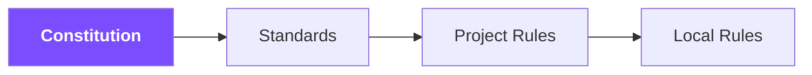
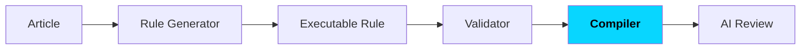
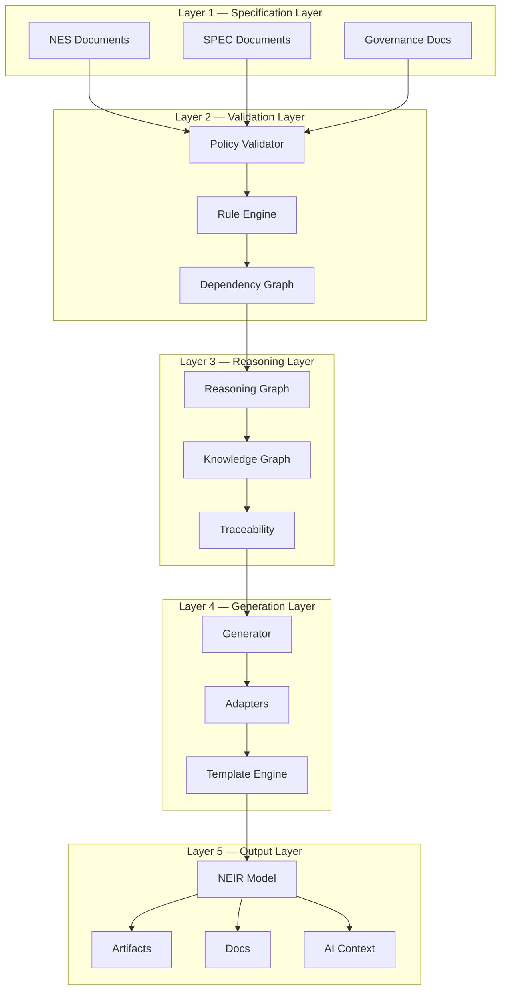
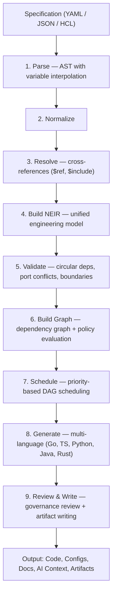
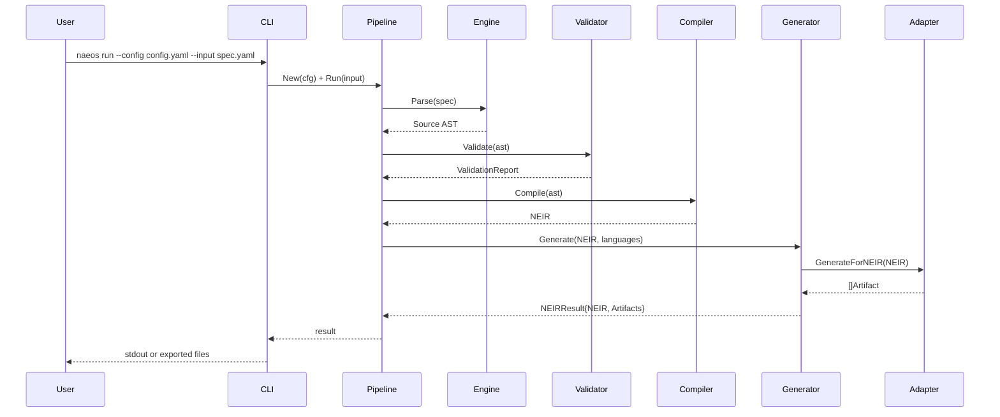
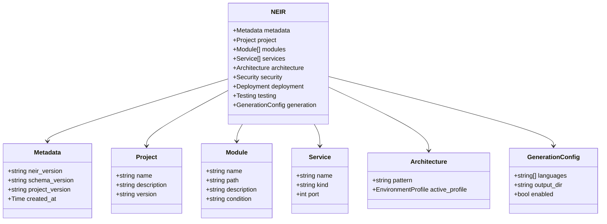
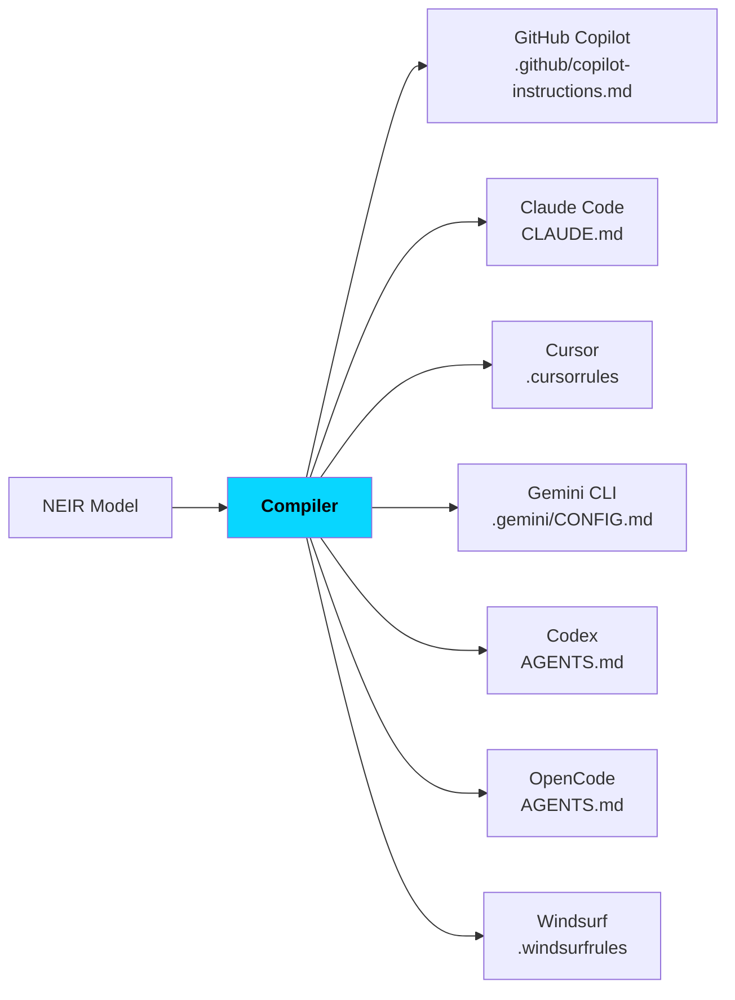

**Nusantara Engineering & Architecture Operating System**

> *"Specify Once. Build Anywhere."*

| | |
|---|---|
| **Document Version** | 1.0.0 |
| **Status** | Public Draft |
| **Project License** | Apache License 2.0 |
| **Repository** | github.com/NAEOS-foundation/naeos |
| **Platform Version** | v3.0.0 (latest release), actively developed toward v2.0.0 Dashboard & Distributed Builds |

---

## Executive Summary

NAEOS is an open-source declarative engineering platform that transforms specifications into high-quality software systems through a consistent, validated, and extensible pipeline. NAEOS is not just a project generator — it is an *engineering runtime* that understands specifications, builds an internal model (NEIR), orchestrates execution plans, generates artifacts, validates results, and keeps projects aligned with their specifications throughout the entire lifecycle.

Under the motto **"Specify Once. Build Anywhere."**, NAEOS enables organizations to describe their system **once**, then build, validate, and evolve software across multiple languages, frameworks, and platforms — with guaranteed traceability from requirements to deployment, and deep integration with the AI coding agent ecosystem.

The platform has reached **v3.0.0** with a feature ecosystem spanning Specification Language v2, a multi-adapter AI compiler, a NEIR-aware LSP, constitution-based governance, a marketplace, and enterprise compliance (SOC 2, HIPAA, GDPR).

---

## 1. Background & Problem Statement

### 1.1 The Fragmentation of Software Engineering

The software industry faces a systemic fragmentation crisis:

- **Multi-language, multi-framework** — A single system now spans Go, TypeScript, Python, Java, and Rust simultaneously, each with its own frameworks, conventions, and toolchains.
- **Specification–implementation drift** — Documentation and code diverge over time; no automated mechanism guarantees alignment.
- **Loss of engineering context** — Architectural decisions, ADRs, and organizational knowledge live only in individuals' heads — undocumented and untraceable.
- **AI tooling explosion** — Each AI coding agent (GitHub Copilot, Claude Code, Cursor, Gemini CLI, Codex, OpenCode) uses a different context and instruction format, forcing organizations to maintain many configuration files with identical content but different formats.
- **Inconsistent governance** — Without enforcement mechanisms, policies, standards, and organizational rules remain static documents that are never executed.

### 1.2 The Cost of Inconsistency

The impact is directly measurable: rework, expensive audits, painful migrations, knowledge loss when team members leave, and failure to meet regulatory compliance (SOC 2, HIPAA, GDPR) due to a lack of verifiable audit evidence.

### 1.3 Thesis

> **The specification is the single source of truth. Everything — code, documentation, configuration, AI context, deployment artifacts — must be derived from the specification through a deterministic, validated, auditable pipeline.**

NAEOS was built to prove this thesis.

---

## 2. Vision & Mission

### Vision

Build an open-source engineering platform that enables developers and organizations to **describe their system once**, then build, validate, and evolve software across multiple languages, frameworks, and platforms — with an engineering constitution enforced automatically.

### Mission

1. Make the declarative specification the single source of truth for every engineering artifact.
2. Provide a deterministic, validated, auditable compilation pipeline.
3. Bridge the gap between governance, specification, and execution through executable policies.
4. Build a universal bridge to all AI coding agents without vendor lock-in.
5. Deliver **technological sovereignty**: a vendor-neutral, language-neutral, cloud-neutral platform.

---

## 3. Foundational Principles: The Engineering Constitution

NAEOS formalizes its principles in the **Engineering Constitution** (NAEOS-CON-001) — the highest normative document, acting as the source of executable rules. Its normative hierarchy:

The twelve constitutional articles:

| # | Article | Essence |
|---|---------|---------|
| I | **Specification First** | No specification = no implementation |
| II | **Knowledge Preservation** | Every engineering decision must be documented (ADR, RFC, API contract) |
| III | **Traceability** | Requirement → Spec → Architecture → Code → Test → Deployment |
| IV | **Single Source of Truth** | No two official artifacts may state conflicting normative information |
| V | **Human Accountability** | AI assists; humans decide and are accountable for releases |
| VI | **Security by Design** | Security is part of design from the start, not a final stage |
| VII | **Documentation as Code** | Documentation is versioned, reviewed, validated, and compiled |
| VIII | **Reproducibility** | Identical input produces identical output |
| IX | **Vendor Neutrality** | No dependency on a single AI vendor |
| X | **Extensibility** | Extension without modifying core specifications |
| XI | **Quality Before Velocity** | Speed must not sacrifice security, maintainability, correctness |
| XII | **Continuous Improvement** | The constitution evolves through RFC and ADR processes |

What makes NAEOS distinctive: **the constitution is not merely a document** — its articles are compiled into executable rules enforced by the Rule Engine, executed by the Validator and Compiler, and checked by AI Review:

---

## 4. Platform Architecture

### 4.1 Layered Model

NAEOS connects five principal layers:

### 4.2 Compilation Pipeline

The core pipeline follows a deterministic flow:

The pipeline is backed by production-grade infrastructure:

- **Stage caching v2** — per-stage cache keyed by NEIR SHA-256 hash; hit rate inspectable via `--profile`.
- **Parallel generation** — concurrent multi-adapter execution (±1.4ms for 3 adapters vs ±3ms sequential).
- **Profiling & memory profiler** — per-stage timing/memory, heap diffing, leak detection.
- **Pipeline middleware** — composable chain (log, metrics, auth, cache).
- **Event sourcing & observability** — execution snapshots, telemetry tracing, WebSocket live updates.

### 4.3 End-to-End Data Flow

---

## 5. Core Components

### 5.1 Specification Language v2

The NAEOS specification language is the single source of truth — human-readable and machine-validatable:

| Feature | Syntax | Purpose |
|---------|--------|---------|
| Variable interpolation | `${var}` | Reference values within a spec |
| Environment variables | `$env{VAR}` | Resolve from environment |
| Cross-references | `$ref{path}` | Reference between spec sections |
| File composition | `$include{file}` | Multi-file specs |
| Built-in functions | `$fn{upper/slug/default/...}` | Value transformations |
| Conditional sections | `$if{cond}...$endif` | Conditional content |

Version 2.0 adds **conditional modules** (`Condition` field), **environment profiles** (`ActiveProfile`/`Inherits`), and schema-based validation with automatic minimum-version checking.

### 5.2 NEIR — NAEOS Engineering Intermediate Representation

NEIR is the **unified engineering model** representing the entire system. NEIR is not merely an AST — it is a canonical model spanning 14 domains:

`project, architecture, domain, module, component, service, API, storage, infrastructure, security, AI, documentation, deployment, testing, metadata`

Technical characteristics:

- **Lazy loading** — per-section accessors; only required data is loaded.
- **Schema versioning** — semver schema registry with remote validation (`naeos schema validate`).
- **Deterministic** — identical input produces identical NEIR (Article VIII).
- **Diff-able** — structural NEIR comparison to track system evolution.

### 5.3 Multi-Language Generator

| Language | Supported Stack | Status |
|----------|-----------------|--------|
| Go | — | Active |
| TypeScript | — | Active |
| Python | — | Active |
| Java | JUnit 5 | Active |
| Rust | Axum 0.7 | Active |

Each adapter produces consistent artifacts: code, configuration, Dockerfiles (5 languages), docker-compose, and Kubernetes manifests.

### 5.4 Kernel & Runtime

- **Service Registry** — centralized service registration
- **Event Bus** — internal pub/sub with PipelineObserver
- **Telemetry** — spans, batched export, HTTP exporter, Prometheus metrics
- **Lifecycle Management** — health checks, graceful shutdown, WebSocket draining

### 5.5 AI Integration & Compiler

The NAEOS compiler transforms NEIR into **AI instruction sets** for 7 target tools:

Additionally:

- **MCP Server** — Model Context Protocol for agent integration (validate_spec, compile_spec, list_artifacts, get_pipeline_status, export_terraform, list_plugins).
- **Context Bundles** — LLM-optimized project summaries enriched with dependency graphs, security context, and cloud resource mapping.
- **AI Compiler Adapter** — streaming spec compilation to LLMs (OpenAI, Anthropic, Ollama) with true SSE streaming.
- **Prompt Library** — centralized YAML-based prompt templates (LLM + compiler adapters) with custom template functions.
- **NEIR-aware LSP** — Language Server Protocol for spec YAML: autocomplete, diagnostics, hover, go-to-definition, code actions — with real parser integration.
- **VS Code extension** — extension generator (`naeos dx vscode-gen`) with TextMate grammar and LSP client.
- **AI Constitution** (NAEOS-CON-002) — articles specifically governing AI's role in engineering, aligned with Articles V and IX.

### 5.6 Governance & Compliance

**Policy & Governance:**
- Policy Evaluator — 7 operators, 5 built-in rules
- Artifact Review — artifact inspection against governance rules
- Audit Trail — traceable decision trail
- Hierarchical RBAC — admin/developer/viewer roles with parent chains and deny rules; 4 compliance templates (auditor, SOC2, GDPR, HIPAA)

**Enterprise security:**
- **SSO** — OIDC (discovery, JWKS RSA verification, auth code flow), SAML 2.0, LDAP (TCP/TLS, ASN.1 BER)
- **Chained audit** — HashedAuditor (SHA-256 chain with tamper verification), EncryptedAuditor (AES-256-GCM), cloud export (AWS SigV4, GCS HMAC, Azure SharedKey)
- **Compliance frameworks** — SOC 2 (8 controls CC1.1–CC8.1), HIPAA (11 controls 164.308–164.312), GDPR (8 articles), with `GenerateReport()` and `naeos compliance` CLI

**Technical security:**
- API key rate limiting, body size limits, CORS whitelist, X-Request-ID propagation
- WASM plugin sandbox with SHA-256 signature verification
- Real OAuth2 (Google, GitHub), OIDC discovery + JWKS
- Typed error system with 15 error codes + sentinel errors

### 5.7 Ecosystem Marketplace

| Marketplace | Function | Content |
|-------------|----------|---------|
| **Profile** | Publish, search, download | 5 built-in industry profiles: SaaS, AI Agent, FinTech, Healthcare, Government |
| **Plugin** | Install/uninstall/search | WASM runtime (wazero), hot-reload, event bus, public registry |
| **Template** | Publish starter projects | Scaffolding with CI/CD, SDK, and WASM entry point |

Plugins execute safely through a **JSON-over-stdin/stdout sandbox** and **WASI**, with signature verification and lazy loading.

---

## 6. Differentiation: NAEOS vs Conventional Approaches

| Dimension | Conventional Approach | NAEOS |
|-----------|----------------------|-------|
| Source of truth | Many (code, docs, wiki, chat) | One: declarative specification |
| Code & spec | Drift over time | Derived together from spec, always aligned |
| AI context | Manual per-tool files, easily stale | Compiled from NEIR for 6 tools at once |
| Governance | Static documents, never executed | Constitution → Rule Engine → Validator, enforced automatically |
| Traceability | Manual, incomplete | Automatic: requirement → deployment |
| Compliance | Manual, expensive audits | Automatic reports (SOC 2/HIPAA/GDPR) + verifiable audit chain |
| Extensibility | Fork or separate tooling | Official plugin WASM, profile, template marketplace |

---

## 7. Release History & Roadmap

### Releases achieved

- **v0.x** — Foundation: parser, NEIR, pipeline, CLI, 6-adapter compiler, cloud (AWS/GCP/Azure), AI integration, distributed task execution, event sourcing
- **v1.x** — Stability: database layer (PostgreSQL/MySQL/SQLite), 999 lint issues resolved, production hardening, prompt library, observability dashboard
- **v2.x** — Platform: Supabase integration, NEIR v2.0 (conditional modules, env profiles), hierarchical RBAC, OAuth2/OIDC, SSO (SAML 2.0, LDAP), compliance frameworks, hashed + encrypted audit chains, stage caching, LSP, VS Code extension, real distributed builds, pipeline/memory profiling
- **v3.0.0** — Ecosystem release: 20+ new features, changelog, migration guide, deprecation notices

### Platform health metrics (current)

| Metric | Value |
|--------|-------|
| Test coverage | ~77% (target ≥85%) |
| Lint pass rate | 100% (17 linters, incl. gosec & errorlint) |
| CLI commands | 65+ (150+ CLI doc pages) |
| CLI test coverage | ~46% (target 100%) |
| Packages ≥80% coverage | 6 (supabase, messagequeue, marketplace, mcp, migration, and more) |

### Roadmap

- **v1.6.0** — Ecosystem & Documentation (in progress)
- **v2.0.0** — Dashboard UI, distributed builds

---

## 8. Licensing & Project Governance

- **License**: Apache License 2.0 — free to use, modify, and distribute; commercial and internal use permitted with attribution.
- **Document governance**: all standards follow the NES (NAEOS Engineering Specification) flow, ADR (Architecture Decision Record), and RFC with mandatory review.
- **CI/CD**: every PR must pass lint + test + coverage checks; coverage drops block merges; every new API/feature must include documentation before merge.
- **Releases**: GoReleaser multi-platform builds (linux/darwin/windows × amd64/arm64) + multi-arch Docker image + automated blog post (EN/ID) per release.

---

## 9. Use Cases

| Scenario | Value Delivered |
|----------|-----------------|
| **Multi-language startup** | One spec produces Go + TypeScript code and infra, removing ~70% of boilerplate |
| **Regulated organizations** (fintech/healthcare/gov) | Automated policy enforcement + SOC 2/HIPAA/GDPR reports + tamper-evident audit chain |
| **Teams adopting AI coding agents** | AI context compiled for 6 tools from one source — no more stale files |
| **Multi-cloud enterprises** | Terraform HCL for AWS/GCP/Azure from NEIR; industry profiles standardize architecture |
| **Large evolving platforms** | Structural NEIR diff, migration engine v0.1→v0.3, rollback, and spec repair |
| **Teams enforcing quality** | Comprehensive validation (circular deps, port conflicts), fuzz testing, standardized benchmarks |

---

## 10. Risks & Adoption Considerations

- **Plugin ecosystem maturity** — Currently 0 community plugins; targets of 5+ (Q1 2027) and 20+ (Q3 2027). Mitigation: plugin SDK, template generator, and public registry are already available.
- **Spec language learning curve** — Mitigated by LSP, TUI wizard, and 56 NES specification documents.
- **AI determinism challenges** — Constitution Articles V and VIII ensure AI only assists within a deterministic pipeline; humans retain release decisions.

---

## 11. Conclusion

NAEOS offers a structural answer to modern software engineering fragmentation: a platform that enforces **the specification as the source of truth**, **the constitution as governing law**, **NEIR as the unified model**, and **AI as a curated partner** — not a replacement for human judgment.

Under Apache License 2.0, with a vendor-neutral architecture and a growing ecosystem, NAEOS invites organizations and communities to build a more disciplined, traceable, and reproducible future of engineering — where you describe your system **once**, and build it **anywhere**.

---

*NAEOS Foundation — "Engineering With Discipline"*

*This document is based on the actual state of the project (NAEOS-foundation/naeos repository, v3.0.0) and is intended for publication, technical evaluation, and adoption discussions. All technical claims can be verified in the official project documentation (docs/NES-*, specification/, constitution/).*
