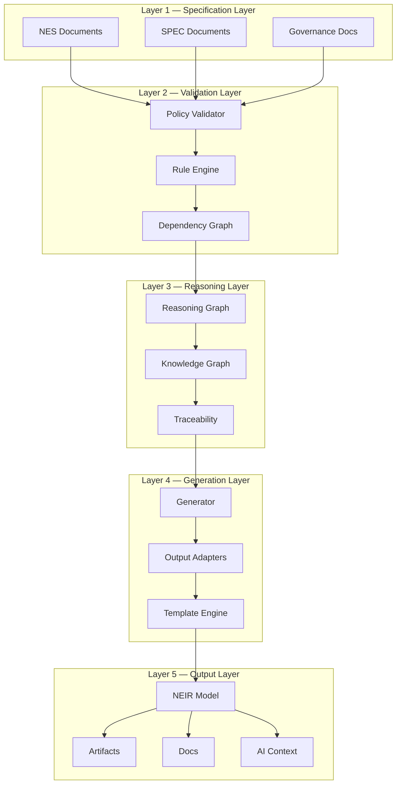
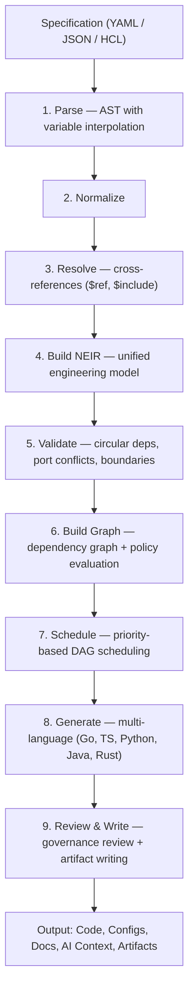
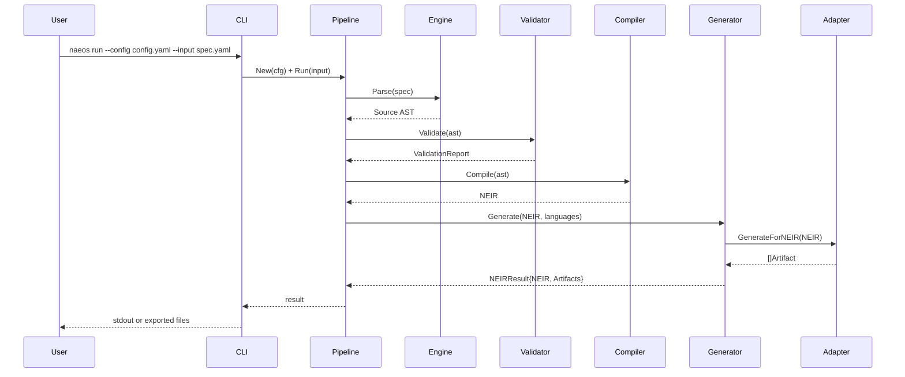

# Chapter 3 — System Architecture

This chapter presents the overall architecture of NAEOS: its layered model, the compilation pipeline, the kernel and runtime services, the repository organization, and the end-to-end data flow.

## 3.1 Architectural Overview

NAEOS is a *declarative engineering runtime*: a long-lived platform (not a one-shot generator) that understands specifications, builds an internal model, orchestrates execution plans, generates artifacts, validates results, and keeps projects aligned with their specification throughout the system lifecycle. The architecture connects five principal layers:



The layering encodes the core thesis of the platform (Section 1.4): normative intent enters at Layer 1; it is validated against executable rules at Layer 2; decisions and provenance are recorded at Layer 3; artifacts are synthesized at Layer 4; and everything materializes from the canonical NEIR model at Layer 5. No path exists from output back to authority — artifacts are always *derived*, never independently normative.

## 3.2 The Compilation Pipeline

The pipeline is the deterministic heart of the runtime. It is implemented in `pkg/pipeline` as an orchestrating engine that wires injectable stages (parser, validator, compiler, generator) configured through a `Config` struct, following the constructor pattern `New(cfg)` used across the codebase.

### 3.2.1 Stages



Stages 1–3 (`internal/specification`) turn raw text into a resolved AST: parsing produces a source AST with variable interpolation, normalization canonicalizes forms, and resolution expands `$ref{...}` cross-references and `$include{...}` file composition. Stage 4 (`internal/compiler`, `internal/neir`) constructs the canonical NEIR model. Stage 5 validates structural integrity (circular dependencies, port conflicts, boundary violations). Stage 6 builds the dependency graph and evaluates governance policies. Stage 7 (`internal/planner`) schedules generation work as a priority-based DAG so independent units execute concurrently while respecting dependency order. Stage 8 (`internal/generation`) runs language adapters concurrently, and stage 9 applies governance review before writing artifacts to disk.

### 3.2.1.1 Stage Responsibilities in Detail

| # | Stage | Input → Output | Key checks / actions |
|---|---|---|---|
| 1 | Parse | text → AST | syntax, `${}` / `$env{}` interpolation |
| 2 | Normalize | AST → canonical AST | defaults applied, canonical ordering |
| 3 | Resolve | AST → resolved AST | `$ref` links, `$include` expansion, `$fn` evaluation |
| 4 | Build NEIR | resolved AST → NEIR | mapping into the fourteen-domain model |
| 5 | Validate | NEIR → ValidationReport | cycles, port conflicts, boundaries, schema version |
| 6 | Graph + policy | NEIR → DAG + decisions | dependency edges, rule-engine evaluation |
| 7 | Schedule | DAG → execution plan | priorities, parallelization groups |
| 8 | Generate | NEIR × languages → artifacts[] | adapter fan-out (code, infra, docs) |
| 9 | Review & write | artifacts[] → files | governance review, atomic writes |

The table exposes a deliberate design invariant: **every stage is a pure function of its input plus configuration**. No stage reads global mutable state; consequently each stage can be cached on its input hash, fuzzed in isolation, replayed from event-sourced snapshots, and executed on distributed workers without hidden coupling.

### 3.2.2 Pipeline Infrastructure

The pipeline is backed by production-grade infrastructure, each element isolated in its own package:

- **Stage caching** (`internal/pipelinecache`): per-stage cache keyed by the SHA-256 hash of the relevant content (specification or NEIR), enabling incremental re-runs; hit rates are inspectable via `--profile`.
- **Parallel generation**: concurrent multi-adapter execution (measured ≈1.4 ms for three adapters versus ≈3 ms sequential; see Chapter 6).
- **Profiling** (`pkg/pipeline`): per-stage timing and memory measurement, heap diffing, and leak detection; run-level profiling via `--profile`/`--pprof`.
- **Middleware** (`internal/pipelinemiddleware`): a composable chain (logging, metrics, auth, cache) wrapped around stage execution.
- **Event sourcing & observability** (`internal/eventsourcing`, `internal/configreload`, `pkg/kernel`): execution snapshots, telemetry tracing, WebSocket live updates, and hot-reload of configuration.
- **Broker abstraction** (`internal/broker`): pluggable message-broker layer (in-memory default; Redis, NATS, RabbitMQ, Kafka adapters) used for asynchronous coordination, including dead-letter handling (Section 4.5).

## 3.3 Kernel and Runtime Services

The kernel (`pkg/kernel`) provides lifecycle management and internal communication for all long-running components:

| Service | Responsibility |
|---|---|
| Service Registry | centralized registration/discovery of runtime services |
| Event Bus | internal publish/subscribe; pipeline stages emit events observed by `PipelineObserver` implementations |
| Telemetry Hub | spans, batched export, HTTP exporter, Prometheus metrics |
| Lifecycle Manager | health checks, graceful shutdown, WebSocket connection draining |

The kernel's contract is deliberately narrow — lifecycle, events, telemetry, registry — so that every subsystem (pipeline, gateway, MCP server, distributed workers) integrates identically. This uniformity is what allows a pipeline to run unchanged as a CLI invocation, inside the API gateway process, or on a distributed worker: the mode determines *which kernel services are present*, never *how stages behave*.

This kernel design keeps the CLI front-end (`cmd/naeos`, ~67 Cobra subcommands) thin: commands compose kernel services and pipeline configurations rather than implementing behavior directly.

### 3.3.1 Interaction Patterns

Three interaction styles coexist deliberately:

1. **In-process composition** — CLI commands instantiate pipeline and services directly (fast path, used by `run`, `validate`, `compile`);
2. **Event-driven decoupling** — long-running components (gateway, MCP server, distributed workers) communicate through the kernel event bus and broker abstraction, so producers need not know consumer topology;
3. **Streaming observation** — `PipelineObserver` implementations subscribe to stage events, feeding telemetry export, WebSocket dashboards, and event-sourced snapshots without polluting stage logic with presentation concerns.

The pattern selection rule is operational: anything that must survive process restarts or span machines goes through the bus/broker; everything else stays in-process for latency and simplicity.

## 3.4 Configuration Model

Configuration follows a two-level model mirroring the normative hierarchy: **platform configuration** (`config.yaml`/`config.example.yaml`) selects runtime behavior — output adapters, generation targets, cache locations, telemetry exporters — while the *specification* remains purely about the engineered system. This separation prevents an anti-pattern in which tool settings leak into system definitions: changing CI verbosity must never touch the source of truth. Configuration loading and validation live in `pkg/config`; hot-reload (`internal/configreload`) revalidates changed files before adoption, so a malformed edit cannot crash a running gateway.

## 3.5 Error Handling Strategy

Errors are values throughout — no panics cross package boundaries (a house convention). The platform defines a typed error system with fifteen error codes plus sentinel errors (NES-031), enabling programmatic handling by tooling: the LSP maps parser error codes to editor diagnostics; the compiler maps NEIR validation failures to source-mapped messages; the CLI renders human-readable guidance. Stage boundaries translate low-level errors into stage-specific reports (`ValidationReport`), which is what allows per-stage caching to remain sound — a cached stage is skipped only when its input hash matches *and* its previous result was successful.

## 3.6 Deployment Modes

The runtime ships in three deployment modes over the same core:

| Mode | Entry point | Use case |
|---|---|---|
| **CLI** | `naeos <command>` | one-shot runs, validation, compilation; single static binary |
| **Gateway/server** | `naeos gateway`, API + WebSocket | team-shared pipeline service, dashboards, MCP endpoint |
| **Distributed** | `naeos distributed` | multi-worker builds coordinating via broker backends |

All three share the kernel, pipeline engine, and NEIR model; mode selection is a composition decision, not a fork in the codebase.

## 3.7 End-to-End Data Flow

A full invocation proceeds as follows:



Two properties of this flow deserve emphasis. First, **every boundary is typed and testable**: stages communicate through explicit values (AST, `ValidationReport`, NEIR, `[]Artifact`), which is what makes per-stage caching and fuzz testing feasible. Second, the flow is **deterministic by construction**: given identical inputs and configuration, identical outputs result — a constitutional requirement (Article VIII) evaluated empirically in Chapter 6.

## 3.8 Reasoning and Traceability

Between validation and generation sits the reasoning layer: a *reasoning graph* records how decisions derive from requirements; a *knowledge graph* aggregates project knowledge (including provenance tracking per NES-037); and the traceability component links requirement → spec → architecture → code → test → deployment, fulfilling Constitution Article III. This layer is what turns "we generated some files" into an auditable engineering record.

## 3.9 Repository Organization

The implementation mirrors the architecture directly:

```text
naeos/
├── cmd/naeos/            # CLI entry point (~67 commands)
├── pkg/pipeline/         # Pipeline orchestration engine
├── pkg/kernel/           # Kernel services, event bus, lifecycle
├── pkg/config/           # Configuration loading and validation
├── internal/
│   ├── neir/             # NEIR model, builder, validator, versioning
│   │   └── model/        # Domain models (ai, api, architecture, ...)
│   ├── specification/    # Parser, normalizer, resolver
│   ├── compiler/         # NEIR compiler + AI instruction adapters
│   ├── generation/       # Generation engine, adapters, renderers
│   ├── planner/          # Dependency graph + DAG scheduler
│   ├── broker/           # Message-broker abstraction (5 backends)
│   ├── pluginsdk/        # Plugin SDK: scaffold, sandbox, WASM
│   ├── pluginhost/       # Plugin manager, hot reload
│   ├── mcp/, lsp/, gateway/, api/   # Agent & API surfaces
│   ├── governance/, audit/, compliance/ # Policy, audit chains, controls
│   ├── distributed/, eventsourcing/     # Distributed execution, ES
│   └── shared/           # Shared contracts and utilities
├── specification/        # NES/SPEC documents
├── docs/                 # 55+ NES documents, 8 ADRs
└── examples/             # Example specifications
```

## 3.10 Design Principles

Five principles govern every architectural decision, each traceable to a constitutional article:

1. **Human-readable specifications in; machine-readable NEIR out** (Articles I, IV).
2. **Deterministic pipeline execution** — identical input yields identical output (Article VIII).
3. **Vendor neutrality** — no dependency on any single AI vendor, cloud, or language (Article IX).
4. **Extensibility without core modification** — adapters, profiles, templates, and sandboxed plugins (Article X).
5. **Quality before velocity** — validation, review, and audit precede artifact delivery (Article XI).

## 3.11 Scalability and Performance Considerations

Three architectural properties bound the system's scaling behavior favorably:

1. **Stage parallelism** — independent DAG units (adapters, per-module generation) execute concurrently on goroutines; scaling is bounded by adapter count and model size, not by sequential stage latency.
2. **Cache amortization** — content addressing means cost is proportional to *change*, not to *system size*: large systems with small edits re-execute only affected stages.
3. **Lazy NEIR access** — consumers load sections on demand, so memory footprint tracks consumer needs rather than whole-model size; relevant for distributed workers that consume slices.

The known scaling risks are the flip sides: whole-model validation (stage 5) remains O(model), and the broker-based coordination layer adds per-message overheads that matter only at high event rates — acceptable for build-time workloads, which are bursty rather than streaming.

## 3.12 Summary

The architecture realizes a clean separation between *normative* layers (specification, constitution, governance) and *derived* layers (generation, output), mediated by the canonical NEIR model and a deterministic, observable, cacheable pipeline. The next chapter examines the core design decisions in depth: the specification language, NEIR itself, executable governance, the broker abstraction, distributed execution, and the WASM plugin sandbox.
