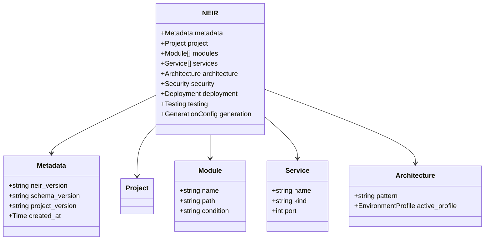

# Chapter 4 — Core Design

This chapter examines the design decisions at the heart of NAEOS: the Specification Language v2, the NEIR intermediate representation, executable governance, the broker abstraction layer, distributed execution, and the WASM plugin sandbox. Wherever a decision was contentious, it is documented as an Architecture Decision Record (ADR) in the repository; this chapter summarizes and analyzes those decisions.

## 4.1 Specification Language v2

The specification language is the user-facing contract of the entire platform — the single source of truth from which everything else derives. It is deliberately *declarative YAML/JSON* (with HCL ingestion supported), chosen for human readability, diff-friendliness in version control, and zero tooling lock-in.

A representative fragment (from `examples/spec-full.yaml`):

```yaml
project: e-commerce-platform

modules:
  - name: auth
    path: ./internal/auth
    description: Authentication and authorization module
    dependencies: [core, user]
  - name: order
    path: ./internal/order
    description: Order processing module
    dependencies: [core, user, payment]

services:
  - name: api-gateway
    kind: http
    port: 8080
    endpoints:
      - method: POST
        path: /auth/login
        action: login
```

### 4.1.1 Language Features

| Feature | Syntax | Purpose |
|---------|--------|---------|
| Variable interpolation | `${var}` | reference values within a spec |
| Environment variables | `$env{VAR}` | resolve values from environment |
| Cross-references | `$ref{path}` | reference between spec sections |
| File composition | `$include{file}` | multi-file specifications |
| Built-in functions | `$fn{upper/slug/default/...}` | value transformations |
| Conditional sections | `$if{cond}...$endif` | conditional content |

Version 2.0 added three structurally significant constructs:

- **Conditional modules** (`Condition` field): modules participate in the model only when their condition holds — enabling product-line engineering from a single specification.
- **Environment profiles** (`ActiveProfile`, `Inherits`): named environment variants (dev/staging/prod) with inheritance, declared inside the spec rather than in external overlays.
- **Schema-based validation** with automatic minimum-version checking: a specification declares which schema version it targets, and older schemas are rejected or migrated explicitly.

### 4.1.2 Design Rationale

Two choices deserve justification. First, **YAML over a bespoke DSL**: bespoke DSLs offer expressive power but impose editor, learning, and ecosystem costs; YAML keeps the specification editable with ordinary tools, diffable in code review, and consumable by the LSP (Chapter 5). Second, **explicit resolution directives** (`$ref`, `$include`, `$env`) rather than implicit conventions make every external dependency of a specification visible and therefore auditable — a direct consequence of treating the specification as normative law rather than as configuration convenience.

### 4.1.3 Expressiveness Boundary

A recurring question is what the language deliberately does *not* include: loops, recursion, arbitrary computation. This is a correctness decision, not an omission. Unbounded computation in specifications would (i) make validation undecidable in general, (ii) break the determinism argument (evaluation order could matter), and (iii) invite logic that belongs in generators or code, not in normative declarations. The `$fn{}` built-ins are total functions over strings and values; conditionals are structural; composition (`$include`) is acyclic by validation. The result is a specification language whose evaluation always terminates — a precondition for treating specs as law.

## 4.2 NEIR: The Canonical Intermediate Representation

### 4.2.1 Motivation

ADR-002 records the central architectural decision. Without a shared IR, generating consistent output for N target languages from N specification forms requires **N×M compilers**, each duplicating validation and optimization logic. With NEIR as the hub, the matrix collapses to **N generators over one IR**: validation happens once at IR level, transformations compose, and source maps from spec constructs to NEIR nodes enable precise error reporting.

This is precisely the factoring that made modern compilers tractable (Section 2.3), applied to whole-system engineering instead of computation.

### 4.2.2 Model Breadth

NEIR is not merely an AST of the specification syntax. It is a canonical model spanning fourteen domains:

> `project, architecture, domain, module, component, service, api, storage, infrastructure, security, ai, documentation, deployment, testing, metadata`



The breadth is deliberate: AI context generation (Chapter 5) and compliance reporting require security, deployment, and testing knowledge to live in the same canonical object as services and APIs. A narrow "code-only" IR could not compile governance evidence.

It is equally important to state what NEIR is *not*. It is not an abstract syntax tree of the specification — the AST exists upstream (stage 1–3) and preserves source-level constructs; NEIR is a *semantic* model of the engineered system. Nor is it a general-purpose knowledge graph — it is closed under the fourteen domains, versioned as a schema, and validated as a whole, which is precisely what makes byte-identical serialization possible. The design occupies a deliberate middle point: richer than an AST (system semantics), stricter than a graph (schema governance), broader than code IRs (whole-system scope).

### 4.2.3 Technical Characteristics

- **Deterministic serialization** — identical inputs produce byte-identical NEIR (Constitution Article VIII); this is what makes content-hash caching sound.
- **Semver schema versioning** — `neir_version` and `schema_version` metadata are mandatory; a schema registry (NES-023) supports remote validation via `naeos schema validate`. Generator tests consume NEIR fixtures to catch schema drift early.
- **Lazy loading** — per-section accessors load only required data, keeping large models tractable.
- **Diff-ability** — structural comparison of two NEIR instances tracks system evolution; combined with the migration engine (v0.1→v0.3 migrations, rollback, spec repair), this enables governed evolution of long-lived platforms.
- **Inspectability** — NEIR serializes to JSON/YAML for debugging (`naeos inspect`).

### 4.2.4 Trade-offs

ADR-002 honestly records costs: all generators depend on NEIR schema stability; schema changes require coordinated generator updates; debugging generation failures requires understanding an intermediate state. Mitigations — semver discipline, `naeos validate` integrity checks before generation, fixture-based drift tests, and benchmark tracking across NEIR versions — convert these risks into managed process. The trade is assessed favorably because validation logic exists once rather than five times, and every new capability (AI context, Terraform export, compliance reports) is obtained by writing one consumer against NEIR rather than M per-language implementations.

### 4.2.5 Schema Versioning in Practice

Version governance follows a documented workflow (NES-023, NES-035):

1. **Additive changes** (new optional fields) ship as minor schema versions; generators ignore unknown fields, so old specs remain valid.
2. **Breaking changes** require a major version bump, a migration entry in the migration engine (which currently spans v0.1→v0.3 with rollback support), and coordinated fixture updates across all generator test suites.
3. **Drift detection** is mechanical: generator tests compile NEIR fixtures and compare outputs; a schema change that alters any fixture output fails CI before release.
4. **Minimum-version enforcement**: specifications declare their target schema; the validator rejects or proposes migration for outdated declarations rather than silently guessing intent.

This converts the classic IR-stability risk into an ordinary, reviewable engineering process — the same discipline LLVM applies to its bitcode format.

### 4.2.6 Worked Example

A minimal specification fragment flows through the model as follows: `services[].port` values become `Service.Port` fields validated for uniqueness at stage 5; module dependency lists become edges in the stage-6 dependency graph, where cycles are rejected with source-mapped errors; the `architecture.pattern` field (monolithic / microservices / serverless) selects template sets inside each language adapter while remaining invisible to adapters that do not consume it. One canonical object thus serves validators, schedulers, five code generators, the Terraform exporter, the six AI-context compilers, and the compliance reporter — without any of them communicating laterally.

### 4.3.1 The Constitution

NAEOS formalizes its principles in an Engineering Constitution (NAEOS-CON-001) with twelve articles — from *Specification First* (no specification, no implementation) through *Traceability*, *Reproducibility*, *Vendor Neutrality*, to *Human Accountability* (AI assists; humans decide releases). A second constitution (NAEOS-CON-002) governs AI's role specifically.

What distinguishes NAEOS's constitution from a values poster is its **normative hierarchy and execution semantics**:


Articles are compiled into executable rules by a Rule Generator; those rules are enforced by the Validator during pipeline stage 5, consulted by the Compiler, and checked by AI-assisted artifact review. Governance thus acquires the same property as the rest of the system: it is *derived, executed, and audited*, not merely written.

### 4.3.2 Policy Evaluation and Compliance

The rule lifecycle has four stages: **authoring** (rules written as data in governance documents, not code); **compilation** (the Rule Generator transforms articles and policies into executable checks); **enforcement** (validator, compiler, and artifact-review hooks invoke checks at pipeline stages 5, 4, and 9 respectively); and **evidencing** (every check outcome lands in the audit chain). Concrete enforcement machinery includes:

- **Policy evaluator** — seven operators and built-in rules evaluated against pipeline state;
- **Artifact review** — generated artifacts inspected against governance rules before writing;
- **Audit trail** — `HashedAuditor` implements a SHA-256 hash chain with tamper verification; `EncryptedAuditor` adds AES-256-GCM encryption; cloud export covers AWS SigV4, GCS HMAC, and Azure SharedKey signing;
- **Hierarchical RBAC** — admin/developer/viewer roles with parent chains and deny rules;
- **Compliance frameworks** — SOC 2 (8 controls CC1.1–CC8.1), HIPAA (11 controls 164.308–164.312), GDPR (8 articles), each with programmatic `GenerateReport()` and a `naeos compliance` CLI command;
- **SSO integration** — OIDC (discovery, JWKS RSA verification), SAML 2.0, LDAP (TCP/TLS, ASN.1 BER), plus OAuth2 for Google/GitHub.

For regulated organizations this changes the economics of audit: evidence is a queryable by-product of the pipeline rather than an annual archaeology project.

### 4.3.3 Why a Constitution Rather Than a Rule List

A flat rule list scales poorly: rules multiply, conflict, and lose their justification. The constitutional form adds three properties. **Normativity** — lower-level rules derive their authority from higher articles, so conflicts resolve by reference rather than committee. **Stability with evolution** — articles change only through the RFC/ADR process (Article XII), giving rules a governed changelog. **Explainability** — when a validation fails, the error can cite the article it protects ("port conflict violates Article IV: Single Source of Truth"), which converts enforcement from gatekeeping into teaching.

### 4.3.4 Technical Security Posture

Beneath the governance layer sits conventional-but-complete technical security: API key rate limiting and body-size limits on exposed surfaces; CORS whitelisting; X-Request-ID propagation for cross-service tracing; OAuth2 (Google, GitHub) and OIDC discovery with JWKS RSA verification; SAML 2.0 and LDAP (TCP/TLS with ASN.1 BER encoding) for enterprise identity; and SHA-256 signature verification for all marketplace artifacts. A typed error system (15 codes plus sentinels) prevents error-message information leakage while keeping diagnostics actionable. The design principle is that security controls are *pipeline citizens*: they run as middleware or validators, emit telemetry like any stage, and appear in audit trails — nothing is enforced outside observable paths.

## 4.4 Broker Abstraction Layer

Asynchronous coordination (distributed workers, event-driven pipelines, plugin notifications) is expressed against a `Broker` interface in `internal/broker` with five backends:

| Backend | Role |
|---|---|
| InMemory | default; zero-dependency single-process operation |
| Redis | streams-based distributed messaging |
| NATS | lightweight pub/sub |
| RabbitMQ | AMQP work queues |
| Kafka | high-throughput event log |

A factory pattern selects the backend from configuration; real client adapters and stub variants coexist so tests run without external infrastructure. Dead-letter handling routes poison messages to a dead-letter channel for inspection. Concurrency safety follows the house style: `sync.RWMutex` guards shared state, `atomic.Int64` counters track metrics.

The abstraction is a portability case study in miniature: application logic depends only on the interface; operational characteristics (durability, throughput, ordering guarantees) are deployment decisions, consistent with the vendor-neutrality principle applied to infrastructure.

### 4.4.1 Delivery Semantics

The interface fixes a common semantic floor across backends: at-least-once delivery with explicit dead-lettering for messages that exhaust retry attempts; consumers are required to be idempotent — a constraint that also suits event-sourced pipeline snapshots, where replay must be safe. Backend-specific strengths (Kafka log compaction, RabbitMQ priority queues, NATS subject hierarchy) remain available through typed option structs in the factory, so teams pay complexity only for features they select.

### 4.4.2 Testing Without Infrastructure

Because every backend has both real and stub implementations, the entire test suite exercises broker-dependent logic without containers or network access; integration tests against real brokers run as an opt-in tier. This keeps `go test ./...` fast and hermetic — a property that directly enables the aggressive CI regime described in Chapter 6.

## 4.5 Distributed Execution and Event Sourcing

For builds beyond a single process, `internal/distributed` provides distributed task execution (ADR-006) layered on the broker abstraction, while `internal/eventsourcing` records pipeline execution as append-only event streams. Together they yield: resumable executions, temporal queries ("what did the pipeline do at time T?"), and WebSocket-published live progress (NES-043). Configuration hot-reload (`internal/configreload`) allows operational parameters to change without restarts, watched via file-system events and validated before adoption.

Event sourcing also strengthens governance: an execution is not just logged but *recorded as a fact sequence*, which the hashed auditor chains. Reconstructing any historical build state from its events provides the reproducibility evidence that compliance frameworks demand — the audit trail and the execution history are one structure.

## 4.6 WASM Plugin Sandbox

Third-party extensibility is provided by plugins compiled to WebAssembly, executed with the pure-Go wazero runtime (ADR-008). The design goals were explicit: memory safety, bounded resources, host-API isolation, cross-platform operation without recompilation, and negligible overhead relative to pipeline tasks.

**Mechanics.** Plugins communicate JSON-over-WASI (stdin/stdout) with a host `PluginManager` that instantiates modules in a pre-configured WASI environment. Resource limits are enforced via start-timeout and memory-page caps; a custom exit handler prevents a module from terminating the host. Each plugin declares required capabilities in a `plugin.yaml` manifest, validated against a grant policy *before* instantiation; SHA-256 signature verification (in `internal/marketplace`) ensures integrity before loading. Hot reload watches the plugins directory (fsnotify) and swaps modules on change.

**Trade-offs.** JSON serialization adds per-call latency versus native plugins, and WASM debugging tools remain immature. Mitigations include batched work items per call, a planned binary protocol if profiling shows bottleneck, a `naeos plugin debug` subcommand with verbose logging, and a configurable execution timeout (default 30 s). The decisive advantages — memory isolation by construction, platform neutrality, no CGo in the host binary — align with both the security-by-design (Article VI) and distribution-simplicity requirements of a single-binary CLI tool.

## 4.7 Profiles, Templates, and the Marketplace

Beyond plugins, three distribution mechanisms industrialize reuse across organizations:

| Marketplace | Function | Content |
|---|---|---|
| **Profile** | industry architecture presets | SaaS, AI Agent, FinTech, Healthcare, Government |
| **Plugin** | sandboxed extension units | WASM runtime modules with hot reload |
| **Template** | starter projects | scaffolding with CI/CD, SDK, WASM entry point |

### 4.7.1 Profiles

A profile encodes industry-conventional architectural decisions — typical service topology, storage choices, security baselines, compliance-relevant defaults — as spec-level presets with detection heuristics (NES-051). A healthcare team starting from the Healthcare profile inherits HIPAA-oriented defaults rather than assembling them from blog posts; profile *inheritance* (`Inherits` field) lets organizations specialize a base profile into house standards. Profiles thus operationalize organizational knowledge in exactly the same way the constitution operationalizes principles: as versioned, derivable, reviewable data.

### 4.7.2 Templates

Templates are complete starter projects expressed through the same specification machinery, guaranteeing that a template's output can always be re-derived and evolved by the pipeline — unlike conventional generators whose output immediately detaches from its origin. Template publication includes CI/CD wiring and SDK stubs, so "starting a project" and "joining the governed lifecycle" become the same act.

### 4.7.3 Ecosystem Mechanics

The marketplace provides publish/search/install/uninstall flows with SHA-256 signature verification on all artifacts (NES-008/NES-053). The whitepaper candidly records ecosystem immaturity (zero community plugins at v3.1.0, targets of 5+ and 20+ for 2027); the SDK, template generator, and public registry exist precisely to lower that bootstrapping barrier. For this monograph, the marketplace matters architecturally: it demonstrates that the runtime's extensibility surfaces are themselves specified, versioned, and secured rather than ad hoc.

## 4.8 Implementation Language Choice

ADR-001 justifies Go as the runtime language: fast compilation for developer iteration; goroutines matching the concurrency shape of the problem (parallel stages, streaming, multi-adapter fan-out); statically linked single-binary distribution with cross-compilation (GoReleaser builds linux/darwin/windows × amd64/arm64 plus multi-arch Docker); reproducible module builds; and native WASI compilation for sandboxed sub-components. Acknowledged weaknesses — limited generics and reflection overhead — are mitigated by code generation on hot paths and the WASM boundary keeping third-party code out of the core process entirely. House conventions reinforce reliability: standard-library-first dependencies, constructor-with-config-struct patterns, table-driven tests, race-detector CI, and fuzzing on parsers.

## 4.9 Testing and Verification Strategy

The implementation embeds verification at four layers, each catching a different defect class:

1. **Unit layer** — table-driven tests (`tt` struct convention) on every package; edge-case suites for parsers, resolvers, and validators; concurrency suites with `sync`-primitive stress tests for broker, bus, and cache components.
2. **Property layer** — fuzz testing (`fuzz_test.go`) on parsing stages, generating malformed and adversarial specifications to prove the pipeline degrades with errors rather than corrupting state.
3. **System layer** — end-to-end tests executing full pipelines over example specifications (e.g., `examples/spec-full.yaml`) and asserting artifact-level outcomes; race detector (`-race`) enabled in all CI runs.
4. **Performance layer** — committed benchmark baselines (`bench/baseline.txt`) compared per change, making regressions review-visible.

This layering mirrors the architecture's typed stage boundaries: because stages are pure functions over explicit inputs, each verification layer can target exactly one boundary without mock scaffolding — tests test *the* behavior, not a test-double approximation of it.

## 4.10 Summary

Each core decision serves the same master principle — the specification as single source of truth — by removing a class of divergence: the specification language makes intent explicit and machine-checkable; NEIR makes derivation economical and verifiable; executable governance makes rules binding; the broker and distributed layers keep the runtime deployable anywhere; profiles, templates, and the marketplace turn organizational knowledge into distributable data; and the WASM sandbox admits extension without surrendering control.
