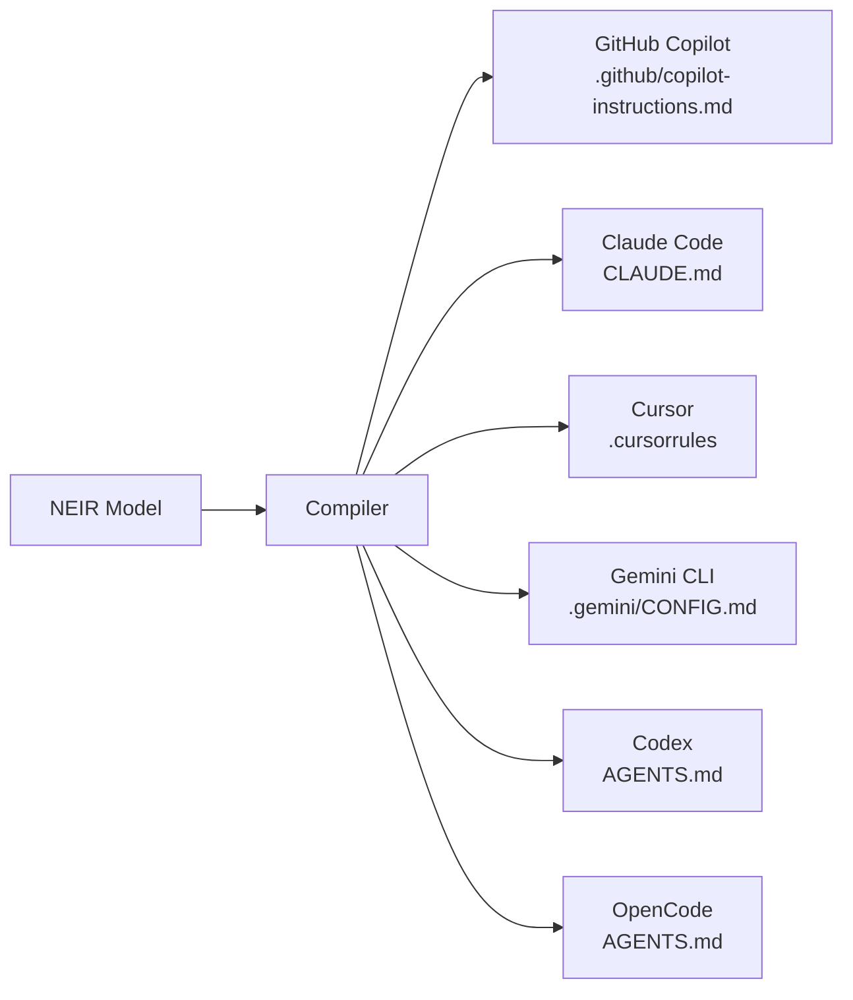

# Chapter 5 — AI-Native Integration

NAEOS treats AI coding agents not as an afterthought but as a *compilation target class*. This chapter describes the four mechanisms by which the platform integrates AI: the multi-agent AI compiler, the MCP server, developer experience tooling (LSP and context bundles), and the prompt library — together forming the answer to research question RQ3.

## 5.1 The Problem of Per-Tool Context

Every mainstream AI coding agent reads project instructions from its own file:

| Agent | Instruction file |
|---|---|
| GitHub Copilot | `.github/copilot-instructions.md` |
| Claude Code | `CLAUDE.md` |
| Cursor | `.cursorrules` |
| Gemini CLI | `.gemini/CONFIG.md` |
| Codex | `AGENTS.md` |
| OpenCode | `AGENTS.md` |

Maintaining these files by hand produces exactly the drift problem described in Chapter 1: six near-copies with independent decay, each silently shaping agent behavior in the repository. The failure mode is insidious because it is *invisible* — nothing breaks when a context file goes stale; the agent simply begins working against last quarter's architecture, and the resulting violations surface as human review burden or, worse, as merged regressions.

The economics compound across the repository fleet: an organization with fifty services and three agents in use maintains on the order of a hundred and fifty near-duplicate documents whose only differences are formatting. Every architectural change multiplies into dozens of manual synchronization points, each an opportunity for omission. The NAEOS compiler eliminates this class of artifact entirely — instruction sets are **derived artifacts**, compiled from NEIR like any other output.

## 5.2 Multi-Agent AI Compiler

The compiler (`internal/compiler`) transforms NEIR into tool-specific instruction sets through six output adapters:



### 5.2.1 Adapter Design Pattern

All six adapters implement one interface over NEIR with a shared renderer layer:

```text
NEIR ──▶ [adapter: tool-specific projection] ──▶ [renderer: markdown/templates] ──▶ instruction file
```

The projection step decides *which* model facts the target tool consumes and in what precedence (e.g., Cursor's rules format emphasizes style constraints; Claude Code's memory file supports richer architectural narrative); the renderer step handles purely syntactic concerns. This split means adding an agent touches only projection logic, and improving rendering quality (e.g., token-efficient formatting) benefits all agents simultaneously — the same N×M collapse applied one more time.

Three properties matter architecturally:

1. **Single source, six formats.** Because adapters consume NEIR (not the raw specification), architectural rules, module boundaries, service topology, security constraints, and testing conventions are stated once and projected faithfully into every agent's dialect. Re-running the pipeline refreshes all six files atomically.
2. **Determinism.** Compilation is a pure function of NEIR; no LLM is involved in producing the instruction files themselves. This preserves reproducibility (Article VIII) even though the *consumers* are nondeterministic systems.
3. **Extensibility.** New agents are new adapters against the same IR — the N×M collapse of Section 4.2 applies to AI targets identically.

Beyond static instruction files, the **AI Compiler Adapter** streams specification compilation to LLM providers (OpenAI, Anthropic, Ollama) over true SSE streaming — used for generative tasks that complement, but never replace, deterministic generation.

## 5.3 Model Context Protocol Server

Static files inform agents about the repository; the MCP server lets agents *act* on it. Following ADR-003, NAEOS exposes its capabilities through a self-describing MCP server rather than vendor-specific integrations.

### 5.3.1 Exposed Tools

| Tool | Capability granted to the agent |
|---|---|
| `validate_spec` | validate a specification and receive structured diagnostics |
| `compile_spec` | run compilation, returning NEIR-level results |
| `list_artifacts` | enumerate derived artifacts with provenance metadata |
| `get_pipeline_status` | inspect live pipeline state (stage, cache hits, errors) |
| `export_terraform` | produce infrastructure definitions from NEIR |
| `list_plugins` | discover installed plugins and their capabilities |

Each tool is deliberately *scoped*: agents can interrogate and invoke the platform's own operations, but cannot bypass validation or write artifacts outside governed paths — the tool surface is the security boundary.

### 5.3.2 Transport and Operations

- The protocol is transport-agnostic (stdio, HTTP, SSE), so the same server serves CLI-embedded agents and remote ones;
- Tool definitions are discovered at runtime by any MCP-compatible client — one server replaces per-vendor adapter code;
- A standalone process mode and an `/mcp/message` API route isolate the server; REST fallbacks serve non-MCP clients; `naeos doctor` validates configuration health;
- The server version is pinned per release and updated deliberately, acknowledging that MCP itself is still evolving (an honestly recorded risk in ADR-003).

The strategic consequence is **vendor neutrality** (Article IX): as agents rise and fall, NAEOS integrates with each through one standard protocol instead of N bespoke integrations — mirroring at the agent layer what NEIR achieves at the language layer.

## 5.4 Developer Experience Tooling

### 5.4.1 NEIR-Aware Language Server

Because specifications are YAML, their quality depends on editing experience. The NAEOS LSP provides autocomplete, diagnostics, hover documentation, go-to-definition, and code actions — backed by the *real* parser (`internal/specification`) rather than generic YAML analysis, so diagnostics reflect actual pipeline semantics. Concretely: completion suggests only fields valid at the cursor's schema location; go-to-definition resolves `$ref` targets across files; diagnostics carry the same error codes as pipeline validation (Section 3.5). A VS Code extension generator (`naeos dx vscode-gen`) emits a TextMate grammar plus LSP client, lowering the adoption barrier flagged in the whitepaper's risk analysis.

The LSP is strategically significant beyond convenience: it converts specification authorship from "editing configuration and hoping" into a guided, validated experience — the same transition that made IaC tooling mainstream once editors understood HCL.

### 5.4.2 Context Bundles

For agents and humans needing rich situational awareness, NAEOS generates **context bundles**: LLM-optimized project summaries enriched with dependency graphs, security context, and cloud resource mapping — again derived from NEIR, again deterministic, again refreshed per pipeline run rather than hand-curated. Structurally, a bundle is a projection of the canonical model tuned to prompt-window constraints: compact enough for context injection, complete enough that an agent never invents constraints the specification already states. Because bundles are artifacts, they inherit artifact discipline — versioning, diffing, and inclusion in traceability chains.

## 5.5 Prompt Library

Prompts used by both the LLM adapter and the compiler are centralized in a YAML-based prompt library (NES-054, ADR-007) with custom template functions. Centralization yields three benefits: prompts become versioned, reviewable engineering artifacts (Article VII); reuse avoids divergence between tools calling similar operations; and evaluation of prompt changes becomes possible because prompts are data, not string literals scattered through code.

The library also serves governance: because prompts are reviewable data, security-sensitive instructions (e.g., how AI review treats credentials or license headers) are auditable and change-controlled like any other rule — not buried in application source.

## 5.6 Containing AI Nondeterminism

RQ3 asked whether nondeterministic AI assistance can coexist with a reproducible pipeline. NAEOS's answer is architectural role separation:

| Role | Deterministic? | Examples |
|---|---|---|
| Derivation of normative artifacts | **Yes** — pipeline only | code generation from NEIR, AI context files, Terraform export, compliance reports |
| Assistance within governed bounds | No — AI allowed | streamed spec compilation, artifact review suggestions |
| Release decisions | Humans only | Constitution Articles V, XI |

The AI Constitution (NAEOS-CON-002) codifies this separation: AI may assist anywhere, decide nowhere. Combined with hashed audit chains (Section 4.3), every AI-influenced step remains attributable. The result is a containment pattern we term **determinism-preserving AI integration**: nondeterminism is permitted only inside roles whose outputs are reviewed, audited, and never directly authoritative.

### 5.6.1 Security Considerations

AI surfaces expand the attack surface, and NAEOS treats them accordingly: MCP traffic is isolated behind its own route/process; prompt injection is mitigated structurally because agent-visible context is *generated from the validated model* rather than scraped from mutable repository text; tool invocations pass through the same RBAC hierarchy as human users; and all AI-assisted review outcomes enter the tamper-evident audit chain. The WASM sandbox principles (least capability, verified inputs) recur here at the AI boundary — untrusted inference output is handled like untrusted plugin code.

## 5.8 The "AI Compiler" Framing

It is worth being precise about the term *AI compiler* as used here, because it differs from ML-system compilers (e.g., XLA, TVM), which optimize tensor graphs. NAEOS's AI compiler compiles **for** AI systems: its targets are the instruction sets and tool interfaces that LLM agents consume. The compiler analogy is exact in structure — a canonical IR, deterministic projections, and backends per consumer — but inverted in purpose: classical compilers make artifacts for machines to *execute*; NAEOS's AI compilation makes artifacts for machines that will themselves *write artifacts*, under human accountability.

This framing yields a testable claim: as agent ecosystems evolve, only the adapter/projection layer should require change. The canonical model, validation, governance, and audit machinery are agent-agnostic. Chapter 6's structural verification of the adapter surface supports this claim; longitudinal confirmation belongs to future work.

## 5.9 Summary

Chapter 5 completes the technical narrative: NAEOS compiles *for* agents (instruction files), connects *to* agents (MCP), supports *humans writing* specs (LSP, bundles), and governs *AI behavior* (constitution, audit). All four mechanisms derive from the same canonical model and obey the same constitutional constraints as every other subsystem.
